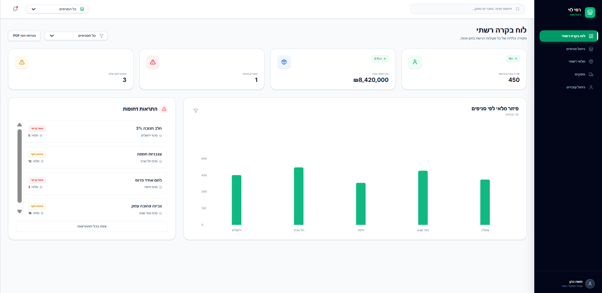
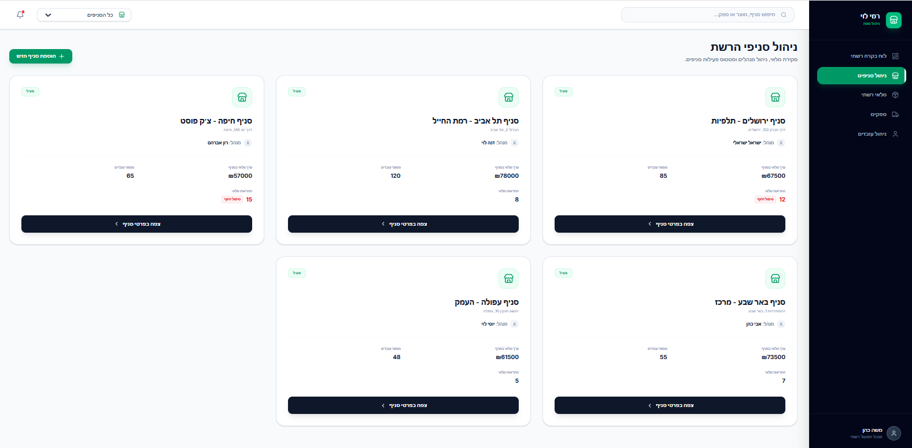
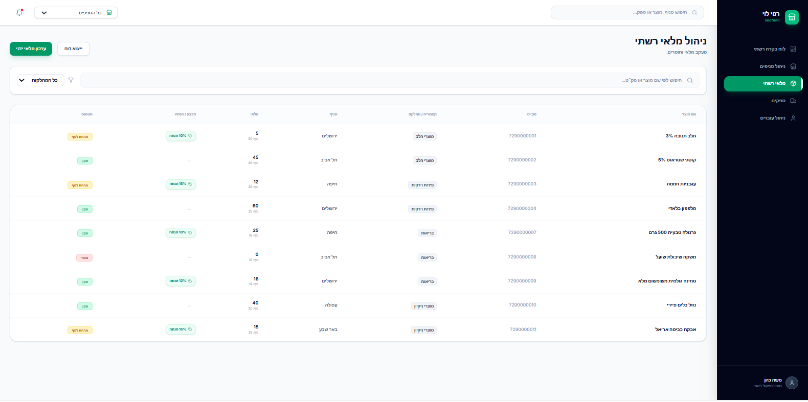
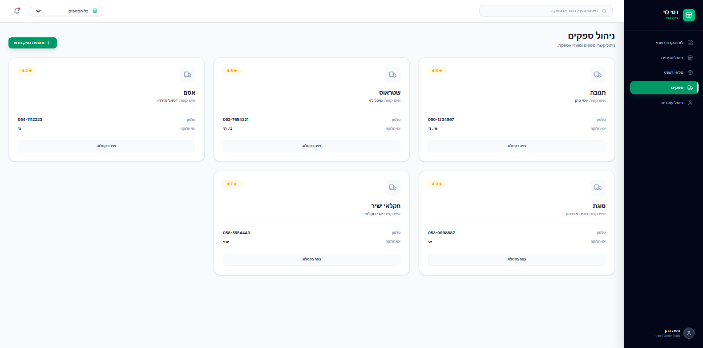
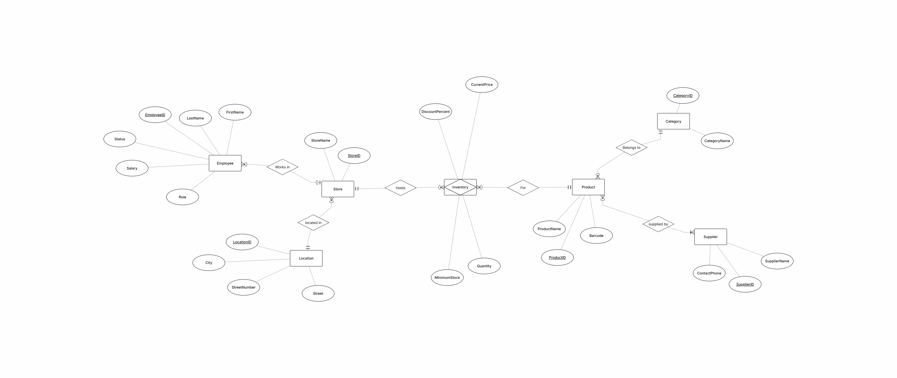

# 🛒 מערכת לניהול רשת חנויות - רמי לוי

מערכת מקיפה לניהול רשת קמעונאית, שפותחה במסגרת קורס "בסיסי נתונים". הפרויקט מתמקד בניהול חכם של סניפים, מלאי, מוצרים וספקים ברחבי הרשת.

## 📋 אודות הפרויקט
הפרויקט מציג פתרון טכנולוגי לניהול הלוגיסטי והתפעולי של רשת **"רמי לוי"**. המערכת מאפשרת למנהלי הרשת ולמנהלי הסניפים לקבל תמונת מצב בזמן אמת על המלאי, לבצע הזמנות רכש ולנהל את נתוני הסניפים השונים בצורה יעילה ומרוכזת.

### ✨ תכונות עיקריות:
* **ניהול סניפים (Store Management):** מעקב מפורט אחרי מיקומי סניפים, שיוך מנהלים וניתוח נתוני מכירות ברמת הרשת והסניף הבודד.
* **ניהול מלאי (Inventory):** בקרה שוטפת על חוסרים במדפים ובמחסני הסניף, כולל התראות על מלאי נמוך.
* **קטלוג מוצרים (Product Catalog):** ניהול פריטים לפי קטגוריות, מחירים ועדכון פרטי מוצר בצורה גלובלית.
* **קשר עם ספקים (Suppliers):** ניהול רשימת ספקים מורשים

---

## 🖼 ממשק המערכת 
*ממשק המשתמש אופיין ועוצב ב-Google AI Studio כדי לדמות מערכת ניהול מודרנית.*

**לוח בקרה רשתי:**

**ניהול סניפים:**

**מלאי רשתי:**

**ספקים ורכש:**

**ניהול עובדים:**

---

## 📊 מודל נתונים (ERD)
המערכת מבוססת על מבנה נתונים יחסי הכולל את הישויות הבאות:
1.  **Store (סניף):** פרטי הסניף, מיקום גיאוגרפי ושיוך ניהולי.
2.  **Product (מוצר):** קטלוג המוצרים המלא של הרשת.
3.  **Supplier (ספק):** פרטי התקשרות וניהול רכש מול ספקים.
4.  **Inventory (מלאי):** טבלת המקשרת בין מוצרים לסניפים (כמויות, מיקום במדף וסטטוס).

---

## 🛠 טכנולוגיות בשימוש
* **בסיס נתונים:** PostgreSQL.
* **מידול:** ERDPlus.
* **אפיון ממשק:** Google AI Studio (Gemini).
