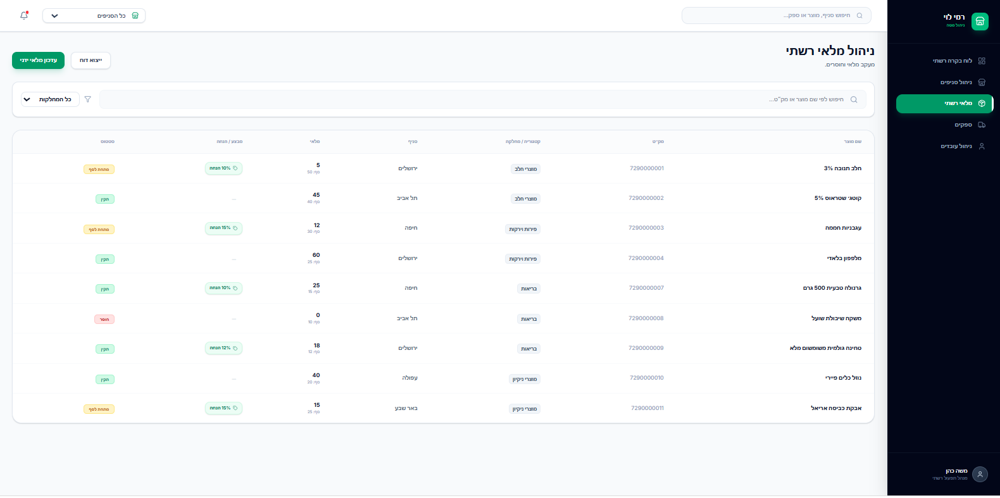

דוח פרויקט: ניהול רשת "רמי לוי" - שלב א'
1. מבוא ותיאור המערכת
המערכת מנהלת את הפעילות העסקית והלוגיסטית של רשת "רמי לוי". היא נועדה לאפשר שליטה מרכזית על מלאי, כוח אדם, ספקים ומבצעים בכל סניפי הרשת.

איפיון מסכים (Google AI Studio)
הגדרנו 5 מסכים מרכזיים המדמים את ממשק הניהול:

לוח בקרה (Dashboard): תמונת מצב רשתית.

ניהול סניפים: פרטי קשר ומיקומי סניפים.

מלאי רשתי: מעקב אחר כמויות ומוצרים.

מערך ספקים: ניהול רכש מול ספקים חיצוניים.

ניהול עובדים: מצבת כוח אדם ושכר.

[לינק לאפליקציה ב-AI Studio](https://ai.studio/apps/954fde94-4343-4ac8-abde-e5b1d80ae363)

2. עיצוב בסיס הנתונים
תרשימי מבנה
תרשים ERD:
בסיס הנתונים כולל 10 ישויות (מעל המינימום הנדרש של 6).
- **תרשים ERD:** 
תרשים DSD:
- **תרשים DSD:** 

החלטות עיצוב ושימוש בטיפוסי נתונים
שימוש ב-DATE: השתמשנו בטיפוס זה בטבלאות PRODUCT (תאריך תפוגה) ו-DISCOUNT (תאריכי התחלה וסיום מבצע).

VARCHAR: הוגדר לכל השדות הטקסטואליים (שמות, כתובות). בטבלת CATEGORY הרחבנו את השדה ל-VARCHAR(100) כדי לתמוך בשמות קטגוריות ארוכים (כמו מוצרי פסח).

Constraints: הוספנו אילוצי NOT NULL להבטחת שלמות הנתונים ומפתחות זרים (FOREIGN KEY) לקישור בין הישויות.

נורמליזציה (3NF)
הסכימה מנורמלת לרמה של 3NF (צורה נורמלית שלישית):

1NF: כל השדות אטומיים ואין קבוצות חוזרות.

2NF: כל השדות שאינם מפתח תלויים באופן מלא במפתח הראשי.

3NF: ביטול תלויות טרנזיטיביות. לדוגמה: פרטי המיקום (עיר, רחוב) הוצאו לטבלת LOCATION נפרדת המקושרת ל-STORE. כך, שינוי בפרטי עיר לא מצריך עדכון בכל שורת סניף, מה שמונע כפילות ובעיות עדכון (Update Anomalies).

3. אכלוס נתונים
אכלסנו את בסיס הנתונים ב-3 שיטות שונות (בכל טבלה לפחות 500 רשומות, ובשתיים מעל 20,000):

שיטת התכנות (Programming):
השתמשנו בסקריפט Python כדי לייצר נתונים לוגיים עבור הטבלאות: INVENTORY, DISCOUNT, PRODUCT, EMPLOYEE, SUPPLIERED_BY, APPLIES_TO.

שיטה ידנית (Manual Insert):
הכנסנו נתונים באופן ידני עבור טבלאות הליבה: STORE ו-CATEGORY.

אתרים חיצוניים (Mockaroo):
השתמשנו באתר Mockaroo ליצירת נתונים מאסיביים (מעל 20,000 רשומות) עבור הטבלאות: SUPPLIER ו-LOCATION.

4. גיבוי ושחזור (Backup & Restore)
ביצענו תהליך גיבוי מלא כדי להבטיח את שרידות הנתונים.

שלבי הגיבוי:
יצירת הגיבוי: שימוש בכלי pg_dump בתוך ה-Docker ליצירת קובץ SQL חיצוני.

docker exec -t PostgreSQL_DB pg_dump -U tova ramileviDB > backup_26_03_2026.sql

שלבי השחזור (בדיקה על סביבה נקייה):
ניקוי: הרצת docker-compose down -v למחיקת הנתונים הקיימים.

שחזור: הזרקת הקובץ חזרה לקונטיינר חדש וריק:

cat backup_26_03_2026.sql | docker exec -i PostgreSQL_DB psql -U tova -d ramileviDB

אימות: בדיקה ב-pgAdmin שהטבלאות והנתונים שוחזרו במלואם.
*

5. קבצי הגשה - שלב א'
01_createTables.sql - יצירת מבנה הטבלאות.

dropTables.sql - מחיקת הטבלאות.

X_insertTables.sql - פקודות הכנסת הנתונים.
כאשר הקבצים ממוספרים מ2 עד 11 עבור כל טבלה בנפרד, על מנת שיהיה קל לעקוב

12_selectAll.sql - שאילתות בדיקה.

backup_26_03_2026.sql - קובץ הגיבוי הסופי.

