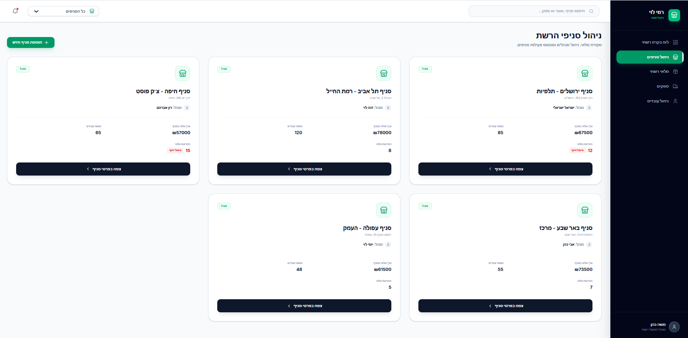
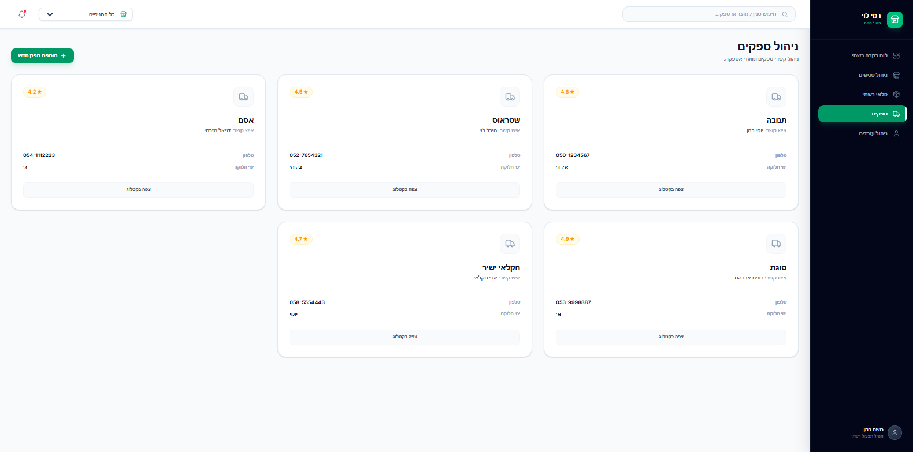
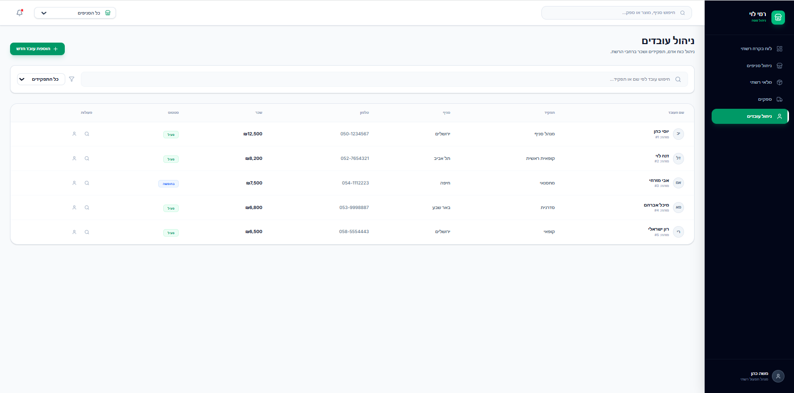
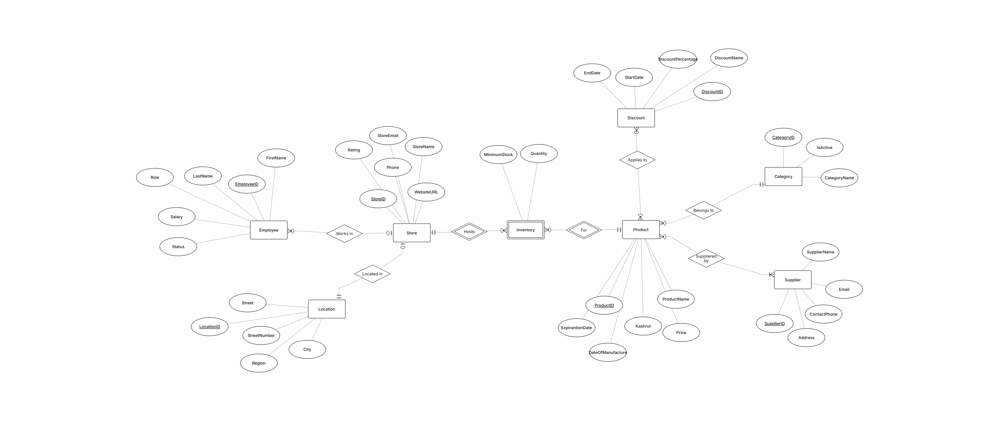
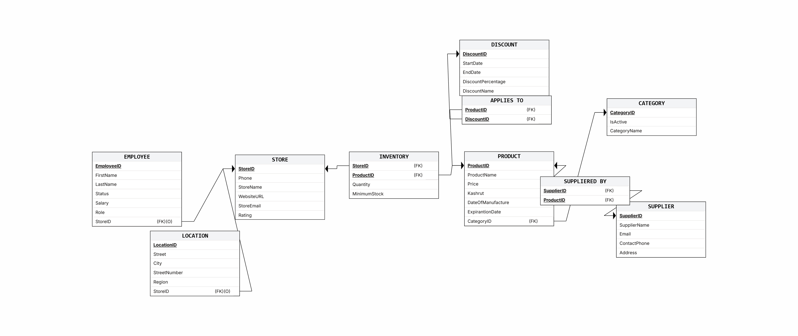

# דוח פרויקט - שלב א'

## מבוא ותיאור המערכת
המערכת מנהלת את הפעילות העסקית של רשת "רמי לוי". היא עוקבת אחר:
- **ניהול סניפים:** מיקום פיזי ופרטי התקשרות.
- **כוח אדם:** פרטי עובדים, תפקידים ושכר.
- **ניהול מוצרים ומלאי:** קטלוג מוצרים לפי קטגוריות ומעקב מלאי בכל סניף.
- **מערך ספקים:** קשר בין ספקים למוצרים שהם מספקים.
- **שיווק ומבצעים:** ניהול מבצעים והחלתם על מוצרים ספציפיים.

## איפיון מסכים (Google AI Studio)
הגדרנו 4 מסכים מרכזיים עבור המערכת:
1. לוח בקרה רשתי.
2. ניהול סניפים.
3. מלאי רשתי.
4. ספקים.
5. ניהול עובדים.

[לינק לאפליקציה ב-AI Studio](https://ai.studio/apps/954fde94-4343-4ac8-abde-e5b1d80ae363)

## עיצוב בסיס הנתונים
בסיס הנתונים כולל 10 ישויות (מעל המינימום הנדרש של 6).

### תרשימי עיצוב
- **תרשים ERD:** 
- **תרשים DSD:** 

### החלטות עיצוב ושימוש בטיפוסי נתונים
כפי שנדרש, ביצענו התאמות לסוגי הנתונים:
- **DATE:** נעשה בו שימוש בטבלת מוצר והנחה.
- **VARCHAR:** לכל שמות האנשים, הערים, והמוצרים.
- **NUMERIC/INT:** למחירים, כמויות ומזהים.
- **Constraints:** הוספנו אילוצי `NOT NULL` ומפתחות זרים להבטחת שלמות הנתונים.

### נורמליזציה
הסכימה מנורמלת לרמה של **3NF**. אין תלויות טרנזיטיביות וכל שדה תלוי במפתח הראשי בלבד.

## אכלוס נתונים
הנתונים הוכנסו ב-3 שיטות:
1. **Programming:** סקריפט Python ליצירת נתונים לוגיים (תיקיית `Programming`).
2. **Mockaroo:** יצירת 20,000 רשומות לטבלאות הגדולות (תיקיית `mockarooFiles`).
3. **Manual Insert:** פקודות SQL ידניות לטבלאות קטנות (תיקיית `insertTables.sql`).

## גיבוי ושחזור
- קובץ הגיבוי נמצא תחת השם `backup_YYYY_MM_DD.sql`.
- בוצע שחזור בהצלחה על סביבת Docker נפרדת.

