# 🛒 דוח פרויקט: ניהול רשת "רמי לוי" - שלב ג'  
##  אינטגרציה ומבטים 統合

הקדמה
בשלב זה של הפרויקט, ביצענו אינטגרציה בין מערכת ניהול רשת השיווק שלנו ("רמי לוי") לבין מערכת חיצונית של ניהול ולוגיסטיקה שקיבלנו. התהליך כלל ניתוח של בסיס הנתונים החדש, הבנת המבנה הלוגי שלו (Reverse Engineering), ומיזוגו לתוך המערכת הקיימת ליצירת בסיס נתונים אחד אחוד.
לאחר מכן כתבנו מבטים.

---
## חלק 1: ניתוח המערכת החדשה (Reverse Engineering)

המערכת שהתקבלה מתמקדת בניהול שרשרת האספקה, משלוחים, אחסון וניהול מלאי. להלן פירוט הטבלאות המרכזיות:

**STORE** (חנויות): ניהול פרטי הסניפים, דירוג ואתר אינטרנט

**PRODUCT** (מוצרים): פרטי המוצר, מחיר ותאריכי תוקף

**WAREHOUSE** (מחסנים): ניהול מיקומי אחסון וכתובות

**DELIVERY COMPANY** (חברות משלוחים): פרטי קשר של ספקי הלוגיסטיקה

**TRUCK** (משאיות/נהגים): ניהול צי הרכב והקשר לחברת השילוח

**ORDER** (הזמנות): ישות קשר מרכזית המחברת בין סניף  לנהג  ומייצגת את תהליך ההזמנה

**CONTAINS**: פירוט המוצרים והכמויות בתוך כל הזמנה 

**LOCATED**: ניהול מיקום פיזי של מוצרים בתוך המחסנים

**PRODUCT_KASHRUT**: ניהול רמות כשרות שונות למוצר

**INVENTORY**: ניהול מלאי ורמות מינימום למוצר

**WAREHOUSE_MANAGER**: ניהול מנהלים מרובים למחסן

**REGION_SERVED**: פירוט אזורי הפעילות של כל חברת משלוחים

---

## חלק 2:  אלגוריתם הינדוס לאחור (Reverse Engineering)

כדי להבין את המבנה של המערכת החדשה מתוך קובץ הגיבוי (SQL) שקיבלנו, פיתחנו אלגוריתם ב-Python המבצע "הינדוס לאחור".

[קישור לאלגוריתם לחץ כאן](analyze.py)


הסבר האלגוריתם:

## הסבר האלגוריתם: 

אלגוריתם זה מבצע ניתוח מעמיק (Parsing) של קבצי גיבוי מסוג PostgreSQL (SQL Dump) במטרה לחלץ את המבנה הלוגי של מסד הנתונים ולהמיר אותו להמלצות עיצוב עבור תרשים ישויות-קשרים (ERD).

## 🚀 פונקציונליות עיקרית

האלגוריתם פועל בשלושה שלבים מרכזיים:

### 1. מיפוי אילוצים (Constraints Mapping)
הכלי סורק את הקובץ ומזהה את כל הקשרים בין הטבלאות:
* **מפתחות ראשיים (PK):** איתור עמודות המזהות באופן ייחודי כל שורה.
* **מפתחות זרים (FK):** זיהוי קשרים והפניות לטבלאות חיצוניות.
* **היקש לוגי (Inference):** במידה ומפתח זר מפנה לטבלה שבה המפתח הראשי לא הוגדר במפורש, האלגוריתם יודע "להסיק" מהו המפתח הראשי של טבלת היעד לצורך השלמת ניתוח הקשרים.

### 2. סיווג ישויות (ERD Logic Classification)
זהו הלב של האלגוריתם. הוא מסווג כל טבלה לאחת מארבע צורות לוגיות המקובלות במודל החן (Chen's Notation):

* **Regular Entity (מלבן):** טבלה עצמאית המכילה נתונים ללא תלות קיומית בישות אחרת.
* **Weak Entity (מלבן כפול):** ישות התלויה בישות אחרת (מזוהה על פי כך שהמפתח הזר שלה הוא גם חלק מהמפתח הראשי).
* **Associative Entity (מעוין בתוך מלבן):** טבלה המקשרת בין שתי ישויות או יותר (קשר "רבים לרבים"), כגון טבלת הזמנות או מיקומים.
* **Multivalued Attribute (אליפסה כפולה):** זיהוי תכונות רב-ערכיות המיוצגות כטבלה נפרדת (מזוהה לרוב לפי קו תחתי בשם הטבלה או לפי מבנה המפתחות).


### 3. ניתוח עמודות והקשרים (Context Analysis)
עבור כל עמודה בכל טבלה, האלגוריתם מפיק דוח הכולל:
* **Classification:** האם העמודה היא PK, FK, או תכונה רגילה.
* **Cardinality Context:** הסבר על עוצמת הקשר (למשל, האם מדובר בקשר של "רבים לאחד" - N:1).

## 📊 פלט האלגוריתם
בסיום ההרצה, מתקבל דוח מפורט המספק למתכנן בסיס הנתונים "מפת דרכים" ויזואלית הכוללת:
1.  **שם הטבלה** כפי שהיא מופיעה במסד הנתונים.
2.  **הצורה הלוגית המומלצת** לציור ב-ERD.
3.  **דוח עמודות מפורט** הכולל את התפקיד הלוגי של כל שדה והקשר שלו לישויות אחרות.


**דוגמת פלט**: 

```
=== FINAL REVERSE ENGINEERING REPORT FOR ERD: BackupSara.sql ===
=============================================================================================================================

[TABLE]: ORDER
ERD SUGGESTION: ASSOCIATIVE ENTITY (Rectangle + Diamond)
Column Name               | Classification                                | Cardinality Context
-----------------------------------------------------------------------------------------------------------------------------
orderid                   | [PK] PRIMARY KEY                              | Identifier
price                     | Regular Attribute                             | -
deliverydate              | Regular Attribute                             | -
orderdate                 | Regular Attribute                             | -
storeid                   | [FK] -> STORE                                 | Many to 1 (N:1)
driverid                  | [FK] -> TRUCK                                 | Many to 1 (N:1)
-----------------------------------------------------------------------------------------------------------------------------

[TABLE]: CONTAINS
ERD SUGGESTION: WEAK ENTITY (Double Rectangle)
Column Name               | Classification                                | Cardinality Context
-----------------------------------------------------------------------------------------------------------------------------
orderid                   | [PK] PRIMARY KEY, [FK] -> ORDER               | Many to 1 (N:1)
productid                 | [PK] PRIMARY KEY, [FK] -> PRODUCT             | Many to 1 (N:1)
quantity                  | Regular Attribute                             | -
-----------------------------------------------------------------------------------------------------------------------------

[TABLE]: DELIVERYCOMPAGNY
ERD SUGGESTION: REGULAR ENTITY (Rectangle)
Column Name               | Classification                                | Cardinality Context
-----------------------------------------------------------------------------------------------------------------------------
deliverycieid             | [PK] PRIMARY KEY                              | Identifier
deliveryciename           | Regular Attribute                             | -
deliveryciephonenb        | Regular Attribute                             | -
email                     | Regular Attribute                             | -
-----------------------------------------------------------------------------------------------------------------------------

[TABLE]: DELIVERYCOMPAGNY_REGIONSERVED
ERD SUGGESTION: WEAK ENTITY (Double Rectangle)
Column Name               | Classification                                | Cardinality Context
-----------------------------------------------------------------------------------------------------------------------------
deliverycieid             | [PK] PRIMARY KEY, [FK] -> DELIVERYCOMPAGNY    | Many to 1 (N:1)
regionserved              | [PK] PRIMARY KEY                              | Identifying Attribute
-----------------------------------------------------------------------------------------------------------------------------

[TABLE]: INVENTORY
ERD SUGGESTION: WEAK ENTITY (Double Rectangle)
Column Name               | Classification                                | Cardinality Context
-----------------------------------------------------------------------------------------------------------------------------
productid                 | [PK] PRIMARY KEY, [FK] -> PRODUCT             | Many to 1 (N:1)
quantity                  | Regular Attribute                             | -
minimumstock              | Regular Attribute                             | -
-----------------------------------------------------------------------------------------------------------------------------

[TABLE]: LOCATED
ERD SUGGESTION: WEAK ENTITY (Double Rectangle)
Column Name               | Classification                                | Cardinality Context
-----------------------------------------------------------------------------------------------------------------------------
productid                 | [PK] PRIMARY KEY, [FK] -> PRODUCT             | Many to 1 (N:1)
warehouseid               | [PK] PRIMARY KEY, [FK] -> WAREHOUSE           | Many to 1 (N:1)
aislenb                   | Regular Attribute                             | -
shelfnb                   | Regular Attribute                             | -
-----------------------------------------------------------------------------------------------------------------------------

[TABLE]: PRODUCT
ERD SUGGESTION: REGULAR ENTITY (Rectangle)
Column Name               | Classification                                | Cardinality Context
-----------------------------------------------------------------------------------------------------------------------------
productid                 | [PK] PRIMARY KEY                              | Identifier
productname               | Regular Attribute                             | -
price                     | Regular Attribute                             | -
dateofmanufacture         | Regular Attribute                             | -
expirationdate            | Regular Attribute                             | -
-----------------------------------------------------------------------------------------------------------------------------

[TABLE]: PRODUCT_KASHRUT
ERD SUGGESTION: WEAK ENTITY (Double Rectangle)
Column Name               | Classification                                | Cardinality Context
-----------------------------------------------------------------------------------------------------------------------------
productid                 | [PK] PRIMARY KEY, [FK] -> PRODUCT             | Many to 1 (N:1)
kashrut                   | [PK] PRIMARY KEY                              | Identifying Attribute
-----------------------------------------------------------------------------------------------------------------------------

[TABLE]: STORE
ERD SUGGESTION: REGULAR ENTITY (Rectangle)
Column Name               | Classification                                | Cardinality Context
-----------------------------------------------------------------------------------------------------------------------------
storeid                   | [PK] PRIMARY KEY                              | Identifier
storename                 | Regular Attribute                             | -
phone                     | Regular Attribute                             | -
rating                    | Regular Attribute                             | -
websiteurl                | Regular Attribute                             | -
-----------------------------------------------------------------------------------------------------------------------------

[TABLE]: TRUCK
ERD SUGGESTION: REGULAR ENTITY (Rectangle)
Column Name               | Classification                                | Cardinality Context
-----------------------------------------------------------------------------------------------------------------------------
driverid                  | [PK] PRIMARY KEY                              | Identifier
active                    | Regular Attribute                             | -
capacity                  | Regular Attribute                             | -
licenseplate              | Regular Attribute                             | -
maintenancestatus         | Regular Attribute                             | -
deliverycieid             | [FK] -> DELIVERYCOMPAGNY                      | Many to 1 (N:1)
-----------------------------------------------------------------------------------------------------------------------------

[TABLE]: WAREHOUSE
ERD SUGGESTION: REGULAR ENTITY (Rectangle)
Column Name               | Classification                                | Cardinality Context
-----------------------------------------------------------------------------------------------------------------------------
warehouseid               | [PK] PRIMARY KEY                              | Identifier
region                    | Regular Attribute                             | -
address                   | Regular Attribute                             | -
-----------------------------------------------------------------------------------------------------------------------------

[TABLE]: WAREHOUSE_WAREHOUSEMANAGER
ERD SUGGESTION: WEAK ENTITY (Double Rectangle)
Column Name               | Classification                                | Cardinality Context
-----------------------------------------------------------------------------------------------------------------------------
warehouseid               | [PK] PRIMARY KEY, [FK] -> WAREHOUSE           | Many to 1 (N:1)
warehousemanager          | [PK] PRIMARY KEY                              | Identifying Attribute
-----------------------------------------------------------------------------------------------------------------------------
```

---
## חלק 3: דיאגרמות DSD ERD של המערכת שהתקבלה

מתוך ניתוח הפלט של האלגוריתם, שרטטנו את המבנה הלוגי של המערכת החדשה:

תרשים DSD (Data Structure Diagram): שורטט בהתאם לתלויות הפונקציונליות והמפתחות שזוהו באלגוריתם.

תרשים ERD (Entity Relationship Diagram): שרטוט גרפי המציג את הישויות, הישויות החלשות והקשרים ביניהן, כולל קרדינליות מלאה.

**DSD**:

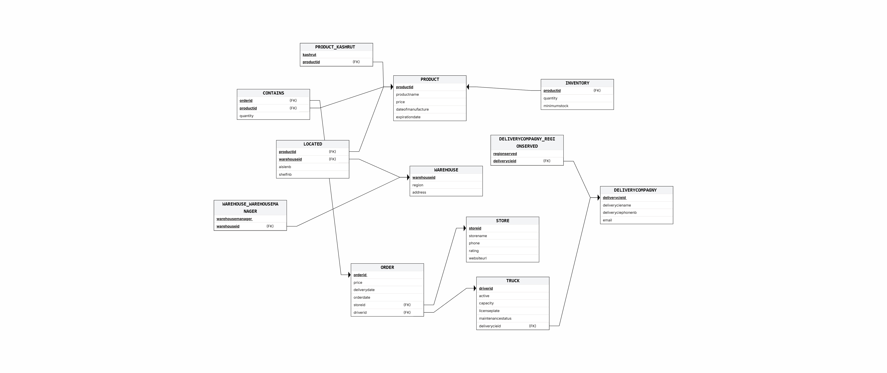

**ERD**

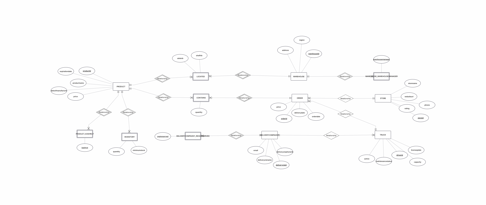

ביצענו בדיקות אחורה על מנת להוכיח שהתרשימים נכונים.

---

## חלק 4: תהליך האינטגרציה
בשלב זה חיברנו את המערכת המקורית שלנו עם המערכת החדשה ליצירת בסיס נתונים אחד אחוד.

**DSD משותף**:

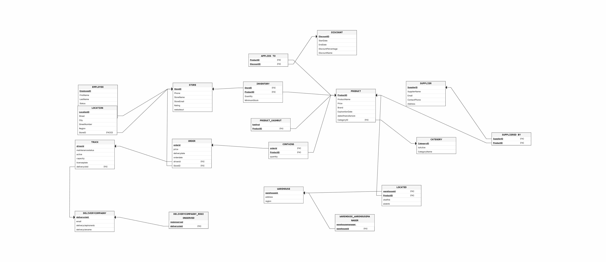

**ERD משותף**

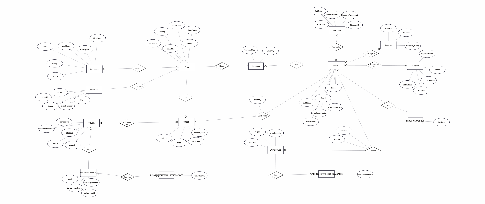

### החלטות עיצוב ואינטגרציה:
לטבלה Store נוספו תכונות   websiteurl address region.
מוזג אליה המידע מהטבלה שקיבלנו עם אותו השם, ומתוך הטבלה LOCATION שלנו מוזג אליה מידע קיים על כתובות חנויות .

LOCATION נמחקה.


לטבלה Product הוסרה התכונה Kashrut ונוספה התכונה dateofmanufacture 
ומוזג אליה המידע מהטבלה של שרה.

איחדנו את הטבלאות Inventory החדשה והישנה , על אף שלחדשה אין שדה מפתח זר StoreID  מהטבלה Store.
כל השורות שהתקבלנו מהטבלה החדשה קיבלו את הערך 1 בתכונה storeID.

וכן יצרנו את כל הטבלאות שלא היו קיימות אצלינו והעברנו אליהן את המידע של הטבלה החדשה.


---
## חלק 5: מבטים (Views) ושאילתות

יצרנו 3 מבטים- כל אחת מנקודת מבט אחרת על המערכת.
ולכל מבט כתבנו 2 שאילתות

* **`v_store_operational_summary` (האגף המקורי - קמעונאות וחנויות):**  
  מבט המציג תמונת מנהלים לגבי היציבות הכלכלית והתפעולית של סניפי הרשת. הוא מרכז עבור כל חנות את מצבת כוח האדם, עלות השכר החודשית המצטברת, ומצב המלאי הנוכחי (מגוון מוצרים וסך פריטים פיזיים).

```
-- ---------------------------------------------------------------------
-- מבט 1: אגף קמעונאות וחנויות (האגף המקורי)
-- הסבר פשוט: מרכז את כל המידע הניהולי על החנויות - כמה עובדים יש, 
-- מה עלות השכר שלהן, וכמה מוצרים ופריטים נמצאים פיזית במלאי של כל סניף.
-- ---------------------------------------------------------------------
CREATE OR REPLACE VIEW v_store_operational_summary AS
SELECT 
    s.StoreID AS store_id,                       -- המספר המזהה של החנות
    s.StoreName AS store_name,                   -- שם סניף החנות
    s.Region AS store_region,                    -- האזור הגיאוגרפי של הסניף
    s.Rating AS store_rating,                    -- דירוג החנות (1 עד 5)
    COUNT(DISTINCT e.EmployeeID) AS total_employees, -- כמות העובדים הפעילים בסניף
    COALESCE(SUM(e.Salary), 0) AS monthly_payroll, -- סך תקציב השכר החודשי של הסניף
    COUNT(DISTINCT i.ProductID) AS unique_products, -- מספר המוצרים השונים שיש לחנות במלאי
    COALESCE(SUM(i.Quantity), 0) AS total_items_stock -- סך כל הפריטים פיזית שנמצאים במחסן החנות
FROM STORE s
LEFT JOIN EMPLOYEE e ON s.StoreID = e.StoreID AND e.Status = 'Active'
LEFT JOIN INVENTORY i ON s.StoreID = i.StoreID
GROUP BY s.StoreID, s.StoreName, s.Region, s.Rating;
```

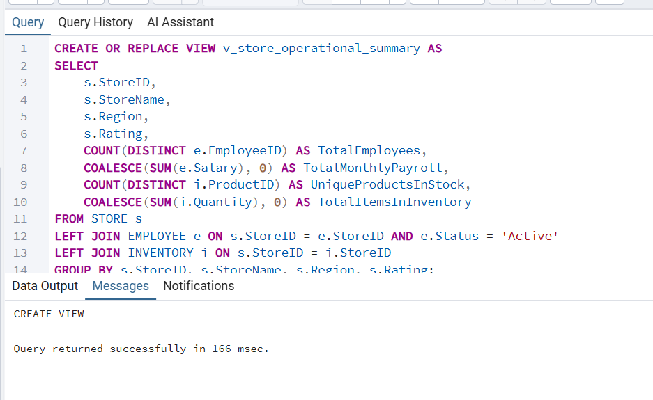

 ##  שאילתות על מבט 1  

 ```
 -- ---------------------------------------------------------------------
-- שאילתא 1 על מבט 1: איתור חנויות מצטיינות
-- הסבר: שולף חנויות מובילות שקיבלו את הציון המקסימלי (Rating 5) כדי לנתח את מאפייניהן.
-- ---------------------------------------------------------------------
SELECT 
    store_name,                                  -- שם סניף החנות ברשת
    store_region,                                -- האזור הגיאוגרפי שבו ממוקם הסניף
    store_rating,                                -- דירוג האיכות או שביעות הרצון של החנות
    monthly_payroll,                             -- סך תקציב השכר החודשי המשולם לעובדי הסניף
    total_items_stock                            -- כמות הפריטים הכוללת שנמצאת כרגע במלאי החנות
FROM v_store_operational_summary
WHERE store_rating >= 5
ORDER BY store_rating DESC;
```

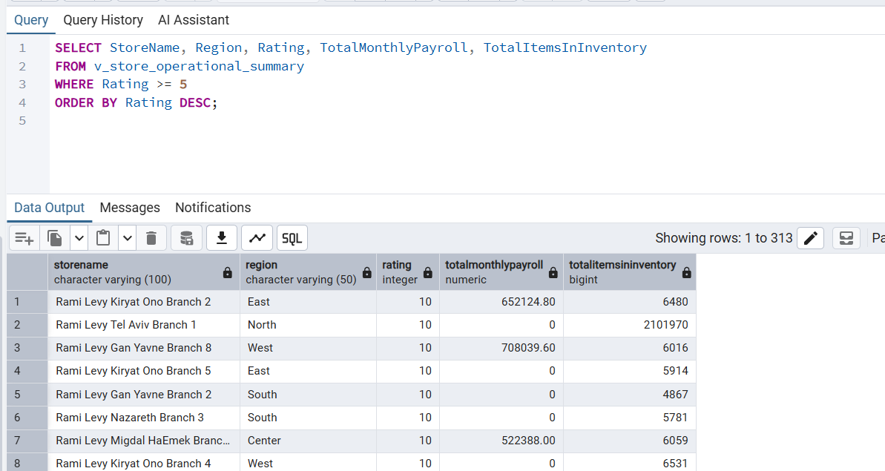

```
-- ---------------------------------------------------------------------
-- שאילתא 2 על מבט 1: ניתוח גיאוגרפי אזורי
-- הסבר: מחשב את ממוצע הפריטים במלאי וסך תקציבי השכר המשולמים בכל אזור פעילות ברשת.
-- ---------------------------------------------------------------------
SELECT 
    store_region AS operational_region,          -- אזור הפעילות של הרשת (צפון, מרכז, דרום וכו')
    COUNT(store_id) AS total_stores,             -- מספר החנויות הפעילות באותו אזור
    ROUND(AVG(total_items_stock), 2) AS avg_stock_per_store, -- ממוצע הפריטים במלאי לחנות יחידה באזור
    SUM(monthly_payroll) AS regional_payroll_spend -- סך כל הוצאות השכר המשולמות באותו חבל ארץ
FROM v_store_operational_summary
WHERE store_region IS NOT NULL
GROUP BY store_region;
```

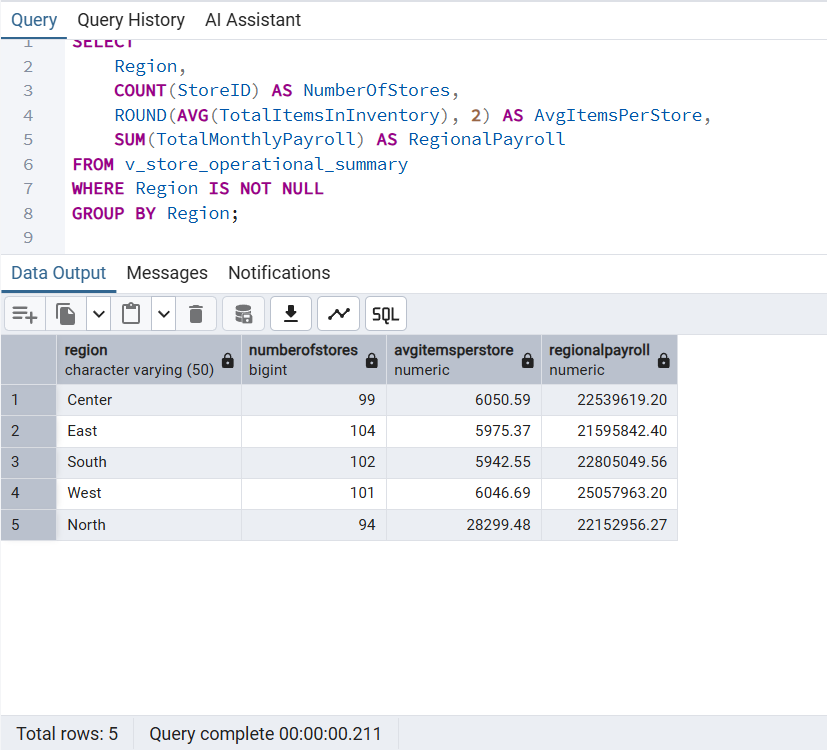

* **`v_delivery_performance_summary` (אגף חדש - לוגיסטיקה והפצה):**  
  מבט המרכז מדדי ביצוע (KPIs) של חברות השילוח החיצוניות. הוא מציג עבור כל חברה את מצבת הנהגים הפעילים, קיבולת הצי הכוללת, כמות המשלוחים שבוצעו בפועל והמחזור הכספי שהן שינעו עבור הרשת.

```
-- ---------------------------------------------------------------------
-- מבט 2: אגף לוגיסטיקה, הפצה ומשלוחים (האגף של שרה)
-- הסבר פשוט: עושה סדר בביצועים של חברות המשלוחים - כמה נהגים פעילים יש להן, 
-- מה נפח ההובלה המקסימלי של המשאיות שלהן, וכמה הזמנות וכסף הן שינעו בפועל.
-- ---------------------------------------------------------------------
CREATE OR REPLACE VIEW v_delivery_performance_summary AS
SELECT 
    dc.DeliveryCieID AS company_id,              -- מזהה ייחודי של חברת המשלוחים
    dc.DeliveryCieName AS company_name,          -- שם חברת הלוגיסטיקה והמשלוחים
    dc.DeliveryCiePhoneNb AS company_phone,      -- טלפון ליצירת קשר עם החברה
    COUNT(DISTINCT t.DriverID) AS active_drivers, -- מספר הנהגים הפעילים שנוהגים כרגע בחברה
    COALESCE(SUM(t.Capacity), 0) AS fleet_capacity, -- קיבולת המשקל המקסימלית של כל צי המשאיות שלהם
    COUNT(DISTINCT o.OrderId) AS orders_handled,  -- סך כל ההזמנות שהחברה שינעה עבור הרשת
    COALESCE(SUM(o.Price), 0) AS revenue_handled -- השווי הכספי המצטבר של כל ההזמנות שבוצעו דרכה
FROM DELIVERYCOMPANY dc
LEFT JOIN TRUCK t ON dc.DeliveryCieID = t.DeliveryCieID AND t.Active = 1
LEFT JOIN "ORDER" o ON t.DriverID = o.DriverID
GROUP BY dc.DeliveryCieID, dc.DeliveryCieName, dc.DeliveryCiePhoneNb;
```

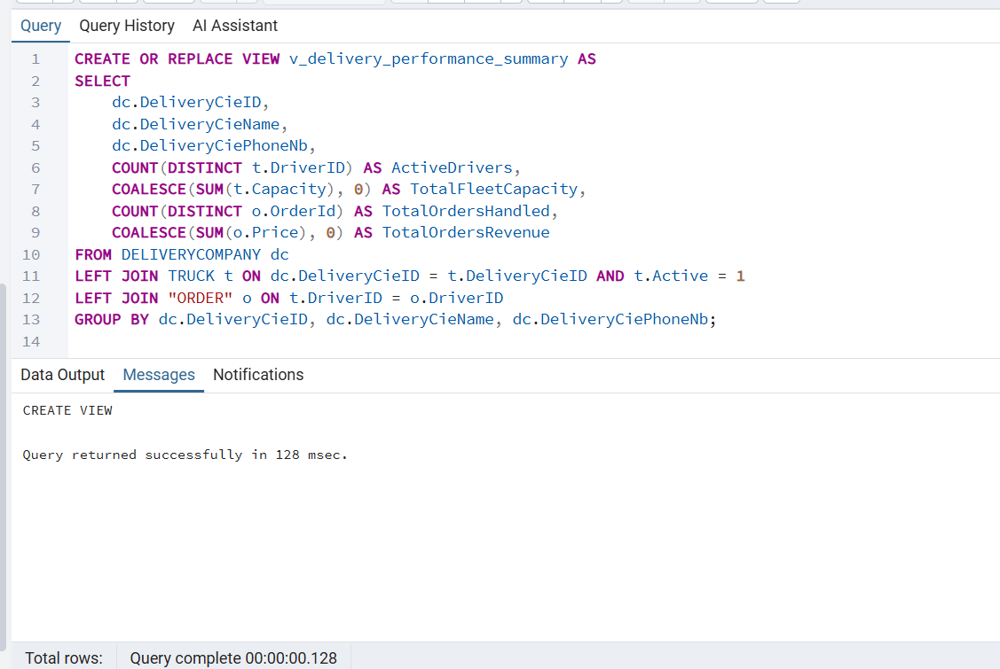

 ##  שאילתות על מבט 2  

```
-- ---------------------------------------------------------------------
-- שאילתא 1 על מבט 2: דירוג פיננסי של חברות השילוח
-- הסבר: מוצא את חברות ההפצה הדומיננטיות ששינעו הזמנות בשווי כספי גבוה מאוד (מעל 10,000 ש"ח).
-- ---------------------------------------------------------------------
SELECT 
    company_name,                                -- שם חברת הלוגיסטיקה והמשלוחים
    active_drivers,                              -- מספר הנהגים הפעילים הרשומים בחברה
    orders_handled AS total_orders_shipped,      -- כמות ההזמנות הכוללת שהחברה שינעה עבורנו
    revenue_handled AS total_revenue_value        -- השווי הכספי המצטבר של כל המשלוחים שטופלו בחברה
FROM v_delivery_performance_summary
WHERE revenue_handled > 10000.00
ORDER BY revenue_handled DESC;
 ```

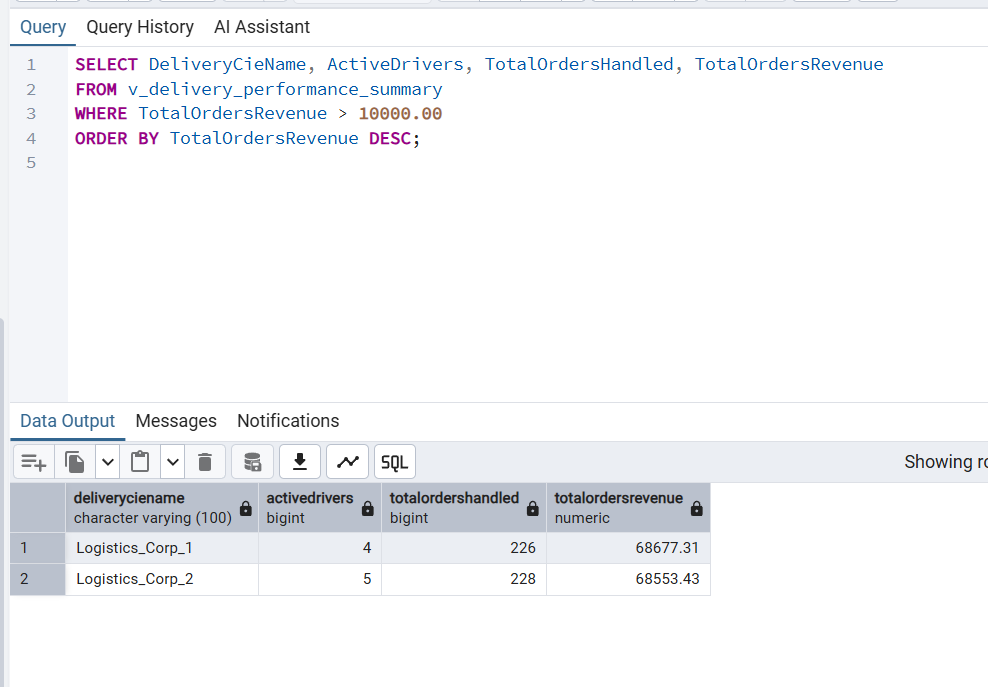

```
-- ---------------------------------------------------------------------
-- שאילתא 2 על מבט 2: ניתוח קיבולת ותשתית לוגיסטית
-- הסבר: מסנן חברות לפי גודל צי הרכב שלהן (קיבולת מעל 500) כדי לבדוק את יעילות הניצול שלהן.
-- ---------------------------------------------------------------------
SELECT 
    company_name AS supplier_name,               -- שם ספק השילוח החיצוני
    fleet_capacity AS total_fleet_capacity,      -- קיבולת הנפח/משקל המקסימלית של כל משאיות החברה יחד
    orders_handled AS active_orders,             -- מספר המשלוחים שבוצעו בפועל
    revenue_handled AS revenue_handled           -- נפח הפעילות הכספית שהופקד בידי אותה חברה
FROM v_delivery_performance_summary
WHERE fleet_capacity >= 500.00
ORDER BY revenue_handled DESC;
```

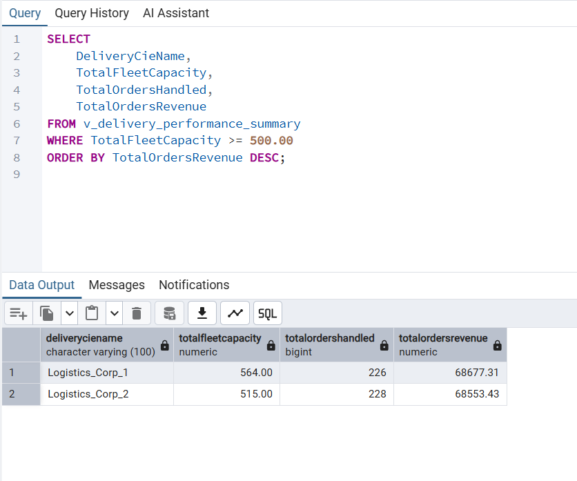

* **`v_integrated_supply_chain` (אגף משולב - קשר בין שני האגפים):**  
  מבט אינטגרטיבי המחבר את שרשרת האספקה מקצה לקצה. הוא מקשר בין ההזמנות והחנויות (האגף המקורי) לבין המיקום הפיזי של המוצרים, המעברים והמדפים בתוך המחסנים הלוגיסטיים (האגף החדש).

  ```
-- ---------------------------------------------------------------------
-- מבט 3: מבט אינטגרטיבי משולב (חיבור בין האגפים)
-- הסבר פשוט: מחבר בין שני האגפים ומציג את שרשרת האספקה המלאה - אילו מוצרים 
-- הוזמנו לכל חנות, מאיזה מחסן לוגיסטי הם מגיעים, ובאיזה מעבר ומדף מדויקים הם מאוחסנים.
-- ---------------------------------------------------------------------
CREATE OR REPLACE VIEW v_integrated_supply_chain AS
SELECT 
    o.OrderId AS order_id,                       -- מספר מזהה של ההזמנה
    s.StoreName AS destination_store,            -- שם חנות היעד שאליה נוסע המשלוח
    p.ProductName AS item_name,                  -- שם המוצר שהוזמן
    p.Brand AS item_brand,                       -- המותג של המוצר
    c.Quantity AS ordered_quantity,              -- כמות היחידות שהוזמנו מהמוצר הזה
    o.OrderDate AS order_date,                   -- תאריך ושעת ביצוע ההזמנה
    w.WarehouseID AS warehouse_number,           -- מספר המחסן הלוגיסטי שממנו הסחורה יוצאת
    w.Region AS warehouse_region,                -- האזור הגיאוגרפי שבו נמצא המחסן
    l.AisleNb AS aisle_number,                   -- מספר המעבר הפיזי בתוך המחסן
    l.ShelfNb AS shelf_number                    -- מספר המדף המדויק בתוך אותו מעבר
FROM "ORDER" o
JOIN STORE s ON o.StoreID = s.StoreID
JOIN CONTAINS c ON o.OrderId = c.OrderId
JOIN PRODUCT p ON c.ProductID = p.ProductID
JOIN LOCATED l ON p.ProductID = l.ProductID
JOIN WAREHOUSE w ON l.WarehouseID = w.WarehouseID;
```

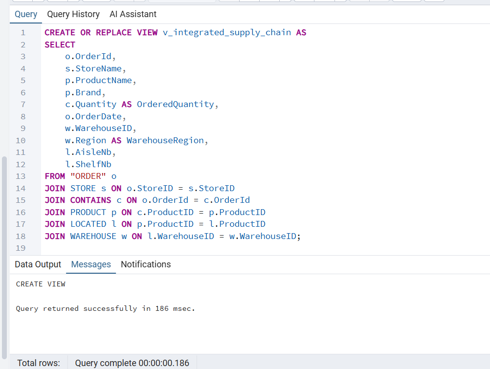

 ##  שאילתות על מבט 3  

```
-- ---------------------------------------------------------------------
-- שאילתא 1 על מבט 3: הפקת רשימת ליקוט למחסנאים
-- הסבר: שולף את כל הפריטים שצריך לאסוף ממחסן מספר 59, ממוין לפי מעבר ומדף לעבודה מהירה.
-- ---------------------------------------------------------------------
SELECT 
    order_id AS target_order_id,                 -- מספר מזהה של ההזמנה שלשמה מלקטים את הסחורה
    destination_store,                           -- שם חנות היעד שאליה יישלח המשלוח בסוף
    item_name,                                   -- שם המוצר הספציפי שצריך לאסוף מהמדף
    ordered_quantity AS items_to_pick,           -- כמות היחידות המדויקת שחובה ללקט
    aisle_number,                                -- מספר המעבר הפיזי בתוך המחסן שבו נמצא המוצר
    shelf_number                                 -- מספר המדף המדויק בתוך המעבר
FROM v_integrated_supply_chain
WHERE warehouse_number = 59
ORDER BY aisle_number, shelf_number;
 ```

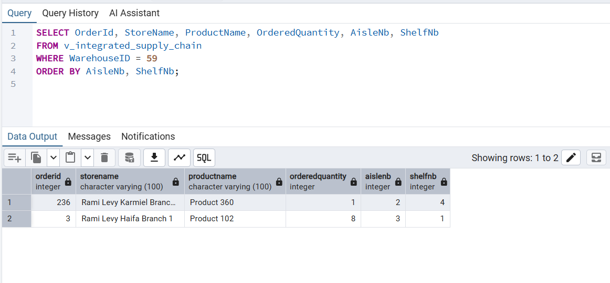

```
-- ---------------------------------------------------------------------
-- שאילתא 2 על מבט 3: סיכום תפוקת מחסנים לוגיסטיים
-- הסבר: מנתח את נפח הפעילות של המחסנים על ידי סיכום הפריטים שיצאו וכמות ההזמנות שנסגרו.
-- ---------------------------------------------------------------------
SELECT 
    warehouse_number,                            -- מציג את המספר המזהה הייחודי של המחסן הלוגיסטי
    SUM(ordered_quantity) AS total_items_sent,   -- מסכם את כל היחידות הפיזיות של המוצרים שנשלחו מהמחסן
    COUNT(DISTINCT order_id) AS total_orders_count -- סופר כמה הזמנות נפרדות ושונות טופלו ויצאו מהמחסן הזה
FROM v_integrated_supply_chain
GROUP BY warehouse_number
ORDER BY warehouse_number DESC;
```

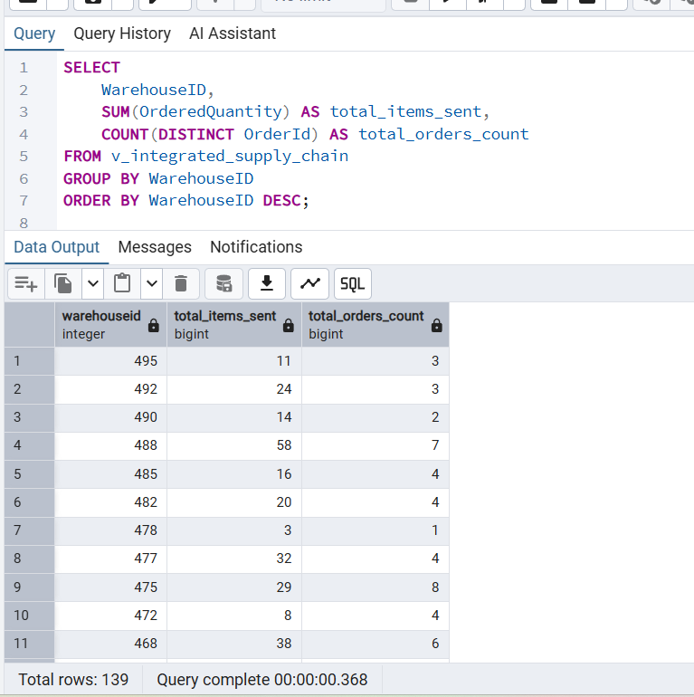


### 🛠️ שימוש ומבנה הקבצים ב-Repository:
* הגדרות ה-`CREATE VIEW` המלאות, יחד עם **2 שאילתות ניתוח עסקיות על כל מבט** (סה"כ 6 שאילתות), מתועדות ומורצות מתוך הקובץ `Views.sql` שנמצא בתיקיית `שלב ג`.
* כל שאילתא בקובץ מגובה בהערות קוד (`--`) המסבירות את הלוגיקה והמטרה התפעולית שלה בצורה פשוטה וברורה.

---
## חלק 6: ## 💾 גיבוי בסיס הנתונים (Database Backup)

### גיבוי בסיס הנתונים בקובץ backup3_20_05_2026.sql .
