# 🛒 דוח פרויקט: ניהול רשת "רמי לוי" - שלב ד'  
## ⚙️ תכנות ב־PL/pgSQL

# הקדמה

בשלב זה של הפרויקט מימשנו שכבת לוגיקה תפעולית מתקדמת מעל בסיס הנתונים המאוחד של רשת "רמי לוי".  
המטרה המרכזית הייתה להרחיב את בסיס הנתונים מעבר לאחסון מידע בלבד, ולהוסיף יכולות אוטומציה, בקרת תקינות, ניהול תהליכים עסקיים ותגובה לאירועים בזמן אמת באמצעות PL/pgSQL.

במהלך השלב פיתחנו:

* 2 פונקציות 
* 2 פרוצדורות
* 2 טריגרים
* 2 תוכניות ראשיות המזמנות כל אחת פונקציה ופרוצדורה

---

# חלק 1: פונקציות (Functions)

בשלב זה יצרנו שתי פונקציות מרכזיות אשר מבצעות חישובים, שליפות וניהול מידע מתקדם מתוך בסיס הנתונים.

---

# 🔹 פונקציה 1 — `[get_active_discounts ]`

**תיאור מילולי:** פונקציה דינמית המיועדת לניהול מערך השיווק והמבצעים של הרשת. הפונקציה מקבלת תאריך נתון כפרמטר קלט, ומפיקה דוח מקיף של כל המבצעים וההנחות התקפים לאותו היום, תוך ביצוע חיבור (`JOIN`) מורכב בין הטבלאות `DISCOUNT`, `APPLIES_TO` ו-`PRODUCT`. הפונקציה מיועדת לעבודה מול תוכנית ראשית המעבדת את המבצעים בזמן אמת.

**אלמנטים ותכנוני PL/pgSQL הממומשים בפונקציה (עמידה בדרישות המטלה):**
* **החזרת Ref Cursor (סעיף b):** הפונקציה מגדירה, פותחת ומחזירה סמן משתנה פתוח (`refcursor` בשם `discount_result_cursor`). אלמנט זה מאפשר לתוכנית הראשי שמזמנת את הפונקציה לשלוף ולעבד את רשומות התוצאה שורה-אחרי-שורה בצורה יעילה וחסכונית במשאבי השרת.
* **הסתעפויות (סעיף d):** שימוש במבנה התנייתי (`IF THEN`) המבצע ולידציה על פרמטר הקלט כדי לוודא שלא הועבר ערך ריק (`NULL`).
* **ניהול חריגות - Exception (סעיף f):** הפונקציה כוללת בלוק טיפול בשגיאות מובנה (`EXCEPTION WHEN OTHERS THEN`) המונע קריסת טרנזקציה במקרה של תקלה בלתי צפויה, מתעד את הודעת השגיאה המקורית מהשרת (`SQLERRM`) באמצעות הודעת מערכת (`RAISE NOTICE`), ומחזיר ערך בטוח לתוכנית הקוראת.

## 💻 קוד הפונקציה

```sql
CREATE OR REPLACE FUNCTION get_active_discounts(check_date DATE)
RETURNS refcursor AS $$
/**
 * פרויקט בסיסי נתונים - שלב ד' - תכנות PL/pgSQL
 * פונקציה מספר 1: שליפת הנחות פעילות עבור תאריך נתון
 * * תיאור: הפונקציה מקבלת תאריך ומחזירה Ref Cursor המכיל את כל ההנחות
 * הפעילות באותו יום, כולל שמות המוצרים עליהם הן חלות.
 * * אלמנטים ממומשים: Ref Cursor, Exception Handling, Conditional Logic (IF)
 */
DECLARE
    -- דרישה: הגדרת סמן משתנה (Ref Cursor) שיחזור לתוכנית הראשית
    discount_cursor refcursor := 'discount_result_cursor';
BEGIN
    -- [1] דרישה: הסתעפות (Conditional Branching) ובדיקת תקינות קלט (Validation)
    IF check_date IS NULL THEN
        -- דרישה: שימוש ב-Exception מונע למקרה של ערך ריק
        RAISE EXCEPTION 'שגיאה במערכת: לא ניתן לבצע בדיקה ללא הזנת תאריך תקין';
    END IF;

    -- הדפסת לוג פנימי למעקב (עוזר מאוד להוכחות ריצה בדו"ח)
    RAISE NOTICE 'מריץ בדיקת הנחות פעילות עבור התאריך: %', check_date;

    -- [2] דרישה: פתיחת ה-Cursor (Explicit Cursor Opening) עבור שאילתה מורכבת
    OPEN discount_cursor FOR
        SELECT d.DiscountName, 
               d.DiscountPercentage, 
               p.ProductName, 
               d.StartDate, 
               d.EndDate
        FROM DISCOUNT d
        JOIN APPLIES_TO a ON d.DiscountID = a.DiscountID
        JOIN PRODUCT p ON p.ProductID = a.ProductID
        WHERE check_date BETWEEN d.StartDate AND d.EndDate;

    -- [3] החזרת הסמן הפתוח לתוכנית הראשי שמזמנת את הפונקציה
    RETURN discount_cursor;

EXCEPTION
    -- [4] דרישה: מנגנון טיפול בשגיאות (Exception Handling Block)
    WHEN OTHERS THEN
        -- תפיסת כל סוגי השגיאות הבלתי צפויות והדפסת הודעה מפורטת
        RAISE NOTICE 'אירעה שגיאה בלתי צפויה בפונקציית ההנחות: %', SQLERRM;
        RETURN NULL;
END;
$$ LANGUAGE plpgsql;

```

---

## ▶️ הפעלת הפונקציה

```sql
BEGIN; -- חובה לפתוח טרנזקציה כשעובדים עם Cursor
SELECT get_active_discounts('2026-05-28'); -- מפעיל את הפונקציה ומאתחל את הסמן
FETCH ALL IN "discount_result_cursor"; -- שולף את הנתונים מתוך הסמן ומציג אותם בטבלה

--בנפרד
COMMIT;
```

---

## ✅ הוכחת תקינות

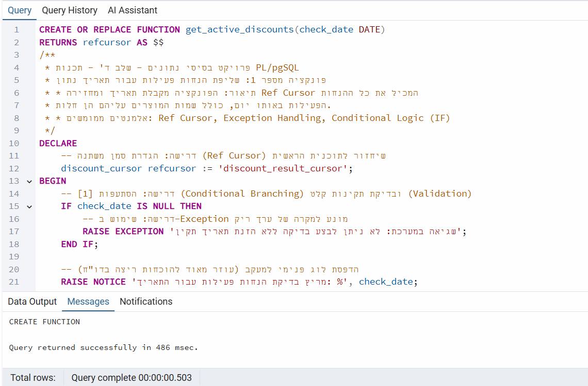

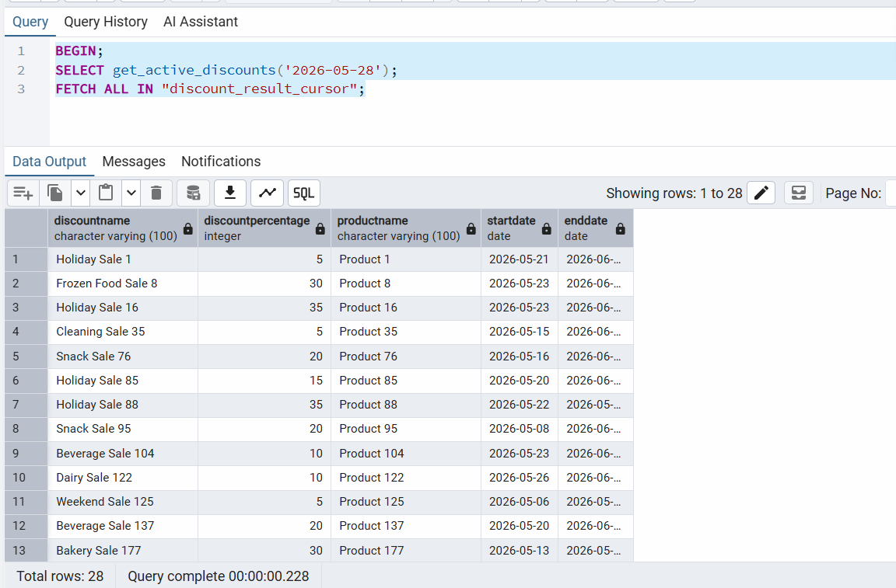


---

# 🔹 פונקציה 2 — `[calculate_order_price]`

**תיאור מילולי:** פונקציה מורכבת המיועדת לסנכרון פיננסי ולחישוב העלות הכוללת של הזמנות ברשת. הפונקציה מקבלת מזהה הזמנה, שולפת את תאריך ביצועה המקורי, ועוברת בלולאה על כל הפריטים המשויכים אליה. עבור כל מוצר, הפונקציה מאתרת דינמית את אחוז ההנחה המקסימלי התקף לאותו תאריך (מתוך טבלת `DISCOUNT`), מחשבת את מחיר הנטו החדש, מעדכנת ישירות את טבלת האם `"ORDER"` ומחזירה את המחיר הסופי.

**אלמנטים ותכנוני PL/pgSQL הממומשים בפונקציה (עמידה בדרישות המטלה):**
* **סמן מפורש - Explicit Cursor (סעיף a):** הגדרה ופתיחה ידנית של סמן מפורש (`cur_order_items`) המבצע `JOIN` בין טבלת הקשר `CONTAINS` לטבלת `PRODUCT` ומאפשר עיבוד נתונים מבוקר.
* **לולאות - Loops (סעיף e):** שימוש בלולאת `LOOP` המשלבת פקודת `FETCH` ותנאי יציאה מובנה (`EXIT WHEN NOT FOUND`) לצורך ריצה סדרתית על פריטי ההזמנה.
* **רשומות - Records (סעיף g):** שימוש ברשומה דינמית (`r_item` מסוג `RECORD`) לקליטה זמנית של נתוני השורות הנשלפות מהסמן בכל איטרציה של הלולאה.
* **פקודות DML ועדכון נתונים (סעיף c):** ביצוע פקודת `UPDATE` ישירה על טבלת `"ORDER"` לעדכון מחיר הנטו הסופי המשוקלל בבסיס הנתונים מתוך הפונקציה.
* **הסתעפויות (סעיף d):** שימוש במבני תנאי (`IF THEN`) לביצוע ולידציות קריטיות: בדיקה אם ההזמנה קיימת במערכת, ובדיקה נוספת למניעת חישוב עבור הזמנות "רפאים" ללא מוצרים.
* **ניהול חריגות - Exception (סעיף f):** שימוש בבלוק `EXCEPTION WHEN OTHERS THEN` הכולל מנגנון הגנה אקטיבי הבודק את סטאטוס הסמן (`%ISOPEN`) וסוגר אותו במידת הצורך למניעת זליגת משאבים, לצד הדפסת הודעת שגיאה מפורטת (`SQLERRM`) וגלגול החריגה מעלה (`RAISE`).

---

## 💻 קוד הפונקציה

```sql
CREATE OR REPLACE FUNCTION calculate_order_price(p_order_id INT)
RETURNS NUMERIC AS $$
/**
 * פרויקט בסיסי נתונים - שלב ד' - תכנות PL/pgSQL
 * פונקציה מספר 2: חישוב ועדכון עלות סופית של הזמנה כולל הנחות
 * * תיאור: הפונקציה מקבלת מזהה הזמנה, רצה בלולאה על כל פריטיה, בודקת הנחות
 * פעילות בהתאם לתאריך המקורי של ההזמנה, ומעדכנת את מחיר הנטו בטבלת האם.
 * * אלמנטים ממומשים: Explicit Cursor, Cursor Loop, RECORD, DML (UPDATE), 
 * Conditional Logic (IF), Exception Handling (כולל בדיקת סטאטוס סמן)
 */
DECLARE
    -- משתנים מקומיים לשמירת תאריך, סכומים ומונים
    v_order_date TIMESTAMP;
    v_total_price NUMERIC(10, 2) := 0.00;
    v_items_count INT := 0;

    -- [1] דרישה: הגדרת סמן מפורש (Explicit Cursor) לחיבור טבלת הקשר עם טבלת המוצרים
    cur_order_items CURSOR FOR 
        SELECT c.ProductID, c.Quantity, p.Price 
        FROM CONTAINS c
        JOIN PRODUCT p ON c.ProductID = p.ProductID
        WHERE c.OrderId = p_order_id;

    -- [2] דרישה: שימוש ברשומה (RECORD) דינמית לצורך מעבר על שורות הסמן
    r_item RECORD;
    v_discount_pct INT;
    v_item_final_price NUMERIC(10, 2);
BEGIN
    -- שליפת תאריך ההזמנה המקורית מטבלת האם
    SELECT OrderDate
    INTO v_order_date
    FROM "ORDER"
    WHERE OrderId = p_order_id;

    -- [3] דרישה: הסתעפות (Conditional Logic) - בדיקה אם ההזמנה בכלל קיימת בבסיס הנתונים
    IF NOT FOUND THEN
        -- דרישה: זריקת חריגה מבוקרת (RAISE EXCEPTION)
        RAISE EXCEPTION 'שגיאה: הזמנה מספר % לא קיימת במערכת.', p_order_id;
    END IF;

    -- [4] דרישה: פתיחה ידנית של הסמן המפורש (Opening Explicit Cursor)
    OPEN cur_order_items;

    -- [5] דרישה: שימוש בלולאה (Loop) לעיבוד שורה-אחרי-שורה
    LOOP
        -- שליפת הרשומה הנוכחית מהסמן לתוך משתנה הרשומה
        FETCH cur_order_items INTO r_item;
        EXIT WHEN NOT FOUND; -- תנאי יציאה מהלולאה כאשר נגמרים המוצרים בהזמנה

        -- קידום מונה הפריטים בהזמנה
        v_items_count := v_items_count + 1;

        -- שליפת אחוז ההנחה המקסימלי התקף עבור המוצר הספציפי ביום ביצוע ההזמנה
        SELECT COALESCE(MAX(d.DiscountPercentage), 0)
        INTO v_discount_pct
        FROM APPLIES_TO a
        JOIN DISCOUNT d ON a.DiscountID = d.DiscountID
        WHERE a.ProductID = r_item.ProductID
          AND v_order_date::DATE BETWEEN d.StartDate AND d.EndDate;

        -- חישוב מחיר הפריט לאחר שקלול אחוז ההנחה שחזר
        v_item_final_price := r_item.Price * (1 - (v_discount_pct / 100.0));

        -- הוספת העלות של השורה הנוכחית (מחיר לאחר הנחה X כמות שהוזמנה) לסך הכל הכולל
        v_total_price := v_total_price + (v_item_final_price * r_item.Quantity);
    END LOOP;

    -- [6] סגירת הסמן המפורש לשחרור משאבי מערכת
    CLOSE cur_order_items;

    -- בדיקה לוגית נוספת: חסימת מקרה של הזמנה "רפאים" ללא מוצרים משויכים
    IF v_items_count = 0 THEN
        RAISE EXCEPTION 'שגיאה: להזמנה מספר % אין מוצרים ולכן לא ניתן לחשב מחיר.', p_order_id;
    END IF;

    -- [7] דרישה: פקודת עדכון בסיס הנתונים (DML UPDATE) מתוך פונקציה
    UPDATE "ORDER"
    SET Price = v_total_price
    WHERE OrderId = p_order_id;

    -- הדפסת הודעת הצלחה מפורטת לחלונית ה-Messages לטובת מעקב (ולוגים בדו"ח)
    RAISE NOTICE 'החישוב הסתיים בהצלחה. המחיר הכולל המעודכן עבור הזמנה % הוא: %',
        p_order_id, v_total_price;

    -- החזרת המחיר הסופי שחושב לתוכנית הקוראת
    RETURN v_total_price;

EXCEPTION
    -- [8] דרישה: בלוק טיפול בחריגות ושגיאות (Exception Handling)
    WHEN OTHERS THEN
        -- מנגנון הגנה: בדיקה אם הסמן נשאר פתוח עקב השגיאה, וסגירתו במידת הצורך
        IF cur_order_items%ISOPEN THEN
            CLOSE cur_order_items;
        END IF;

        -- הדפסת לוג שגיאה מפורט עם תיאור הבעיה המדויק מהשרת (SQLERRM)
        RAISE NOTICE 'אירעה שגיאה בזמן חישוב העלות עבור הזמנה %: %',
            p_order_id, SQLERRM;

        -- גלגול השגיאה הלאה (Re-raise) כדי שהטרנזקציה תיכשל ולא יישמרו נתונים שגויים
        RAISE;
END;
$$ LANGUAGE plpgsql;
```

---

## ▶️ הפעלת הפונקציה

```sql
SELECT calculate_order_price(1);
```

---

## ✅ הוכחת תקינות

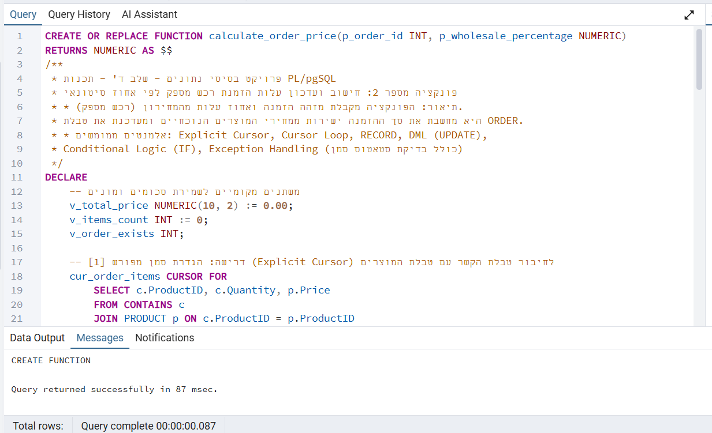

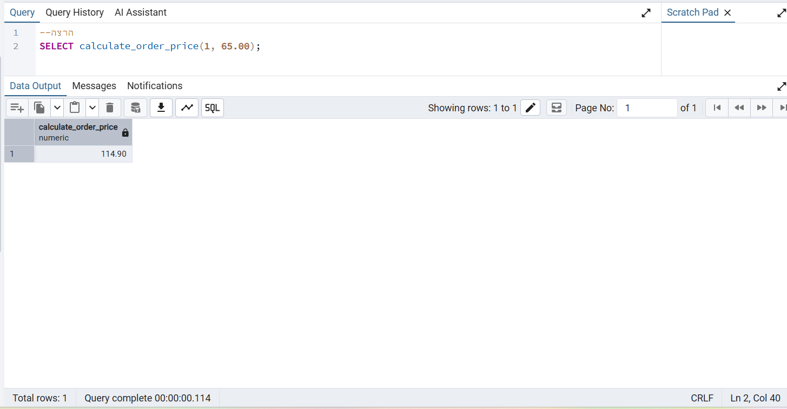

---

# חלק 2: פרוצדורות (Procedures)

בשלב זה פיתחנו שתי פרוצדורות אשר מבצעות פעולות ניהול ועדכון מורכבות על בסיס הנתונים.

---

# 🔹 פרוצדורה 1 — `[discount_near_expiration_products]`

**תיאור מילולי:** פרוצדורה תפעולית-עסקית המיועדת לצמצום הפסדים וניהול פחת של מלאי פג תוקף ברשת. הפרוצדורה מקבלת טווח ימים קדימה ואחוז הנחה רצוי, ומאתרת באופן דינמי את כל הפריטים בטבלת `PRODUCT` שתאריך התפוגה שלהם חל בטווח זה (החל מ-`CURRENT_DATE`). עבור כל מוצר שנמצא, הפרוצדורה מחשבת מחיר מוזל חדש ומעדכנת אותו ישירות בבסיס הנתונים כדי לעודד קנייה מהירה של המוצר לפני פקיעת תוקפו.

**אלמנטים ותכנוני PL/pgSQL הממומשים בפרוצדורה (עמידה בדרישות המטלה):**
* **סמן משתמע - Implicit Cursor (סעיף a):** שימוש בסמן משתמע המנוהל אוטומטית על ידי השרת, ללא צורך בפקודות פתיחה וסגירה ידניות.
* **לולאות - Loops (סעיף e):** שימוש בלולאת `FOR LOOP` מובנית העוטפת את השאילתה הדינמית, ומבצעת איטרציה אוטומטית שורה-אחר-שורה על כלל המוצרים שנמצאו בטווח התאריכים.
* **רשומות - Records (סעיף g):** הגדרת רשומה זמנית (`r_product` מסוג `RECORD`) המשמשת כמצביע דינמי לקליטת נתוני השדות של כל מוצר ומוצר תוך כדי ריצת הלולאה.
* **פקודות DML ועדכון נתונים (סעיף c):** ביצוע פקודת `UPDATE` ישירה על טבלת `PRODUCT` לשינוי ועדכון שדה ה-`Price` של המוצרים הרלוונטיים מתוך הבלוק התכנותי.
* **הסתעפויות (סעיף d):** שימוש במבני תנאי (`IF THEN`) בשלב מוקדם של הריצה כדי לבצע ולידציות קלט קריטיות (מניעת ערכי `NULL`, חסימת ימים שליליים ואכיפת אחוז הנחה הגיוני בין 0 ל-100).
* **ניהול חריגות - Exception (סעיף f):** הפרוצדורה כוללת בלוק טיפול בחריגות (`EXCEPTION WHEN OTHERS THEN`) שתופס שגיאות הרצה בלתי צפויות, מדפיס לוג מפורט עם תיאור השגיאה מהשרת (`SQLERRM`) ומבצע גלגול חריגה (`RAISE`) כדי להבטיח את שלמות הנתונים וביצוע `Rollback` לטרנזקציה במידת הצורך.

---

## 💻 קוד הפרוצדורה

```sql

CREATE OR REPLACE PROCEDURE discount_near_expiration_products(
    p_days_ahead INT,
    p_discount_percent NUMERIC
)

LANGUAGE plpgsql
AS $$
/**
 * פרויקט בסיסי נתונים - שלב ד' - תכנות PL/pgSQL
 * פרוצדורה מספר 2: הורדת מחיר למוצרים שתאריך התפוגה שלהם קרוב
 * * מטרה: לאתר באופן דינמי מוצרים שעומדים לפוג בקרוב ולהחיל עליהם הנחת פחת במחיר.
 * * אלמנטים ממומשים: Implicit Cursor (סמן משתמע), FOR LOOP (לולאת סמן), 
 * RECORD (רשומה), IF (הסתעפות לוגית), UPDATE (פקודת DML), Exception Handling (טיפול בשגיאות).
 */

DECLARE
    -- [1] דרישה: שימוש ברשומה (RECORD) זמנית לקליטת נתוני השורות בתוך הלולאה
    r_product RECORD;
    v_new_price NUMERIC(10,2);
    v_counter INT := 0; -- מונה לספירת כמות המוצרים שעודכנו בפועל
BEGIN
    -- [2] דרישה: מבנה תנאי (IF) - ולידציה על קלט תקין של טווח הימים
    IF p_days_ahead IS NULL OR p_days_ahead < 0 THEN
        -- זריקת שגיאה מבוקרת במידה והפרמטר שלילי או ריק
        RAISE EXCEPTION 'שגיאה: מספר הימים חייב להיות חיובי';
    END IF;

     -- [3] דרישה: מבנה תנאי (IF) - ולידציה על תקינות אחוז ההנחה (חייב להיות בין 0 ל-100)
    IF p_discount_percent IS NULL OR p_discount_percent <= 0 OR p_discount_percent >= 100 THEN
        RAISE EXCEPTION 'שגיאה: אחוז ההנחה חייב להיות בין 0 ל-100';
    END IF;

    -- [4] דרישה: שימוש ב-Implicit Cursor (סמן משתמע) מובנה בתוך לולאת FOR
    -- הסמן שולף את המוצרים שתאריך התפוגה שלהם נופל בטווח הימים המבוקש החל מהיום
    FOR r_product IN
        SELECT ProductID, ProductName, Price, ExpirationDate
        FROM PRODUCT
        WHERE ExpirationDate::DATE BETWEEN CURRENT_DATE 
                                      AND CURRENT_DATE + p_days_ahead
    LOOP

            -- חישוב המחיר החדש לאחר הפחתת אחוז ההנחה שקיבלנו כפרמטר
        v_new_price := r_product.Price * (1 - p_discount_percent / 100.0);

        -- [5] דרישה: ביצוע פקודת DML (UPDATE) - עדכון המחיר החדש ישירות בטבלת המוצרים
        UPDATE PRODUCT
        SET Price = v_new_price
        WHERE ProductID = r_product.ProductID;

        -- קידום מונה העדכונים
        v_counter := v_counter + 1;

        -- הדפסת הודעת פירוט (Log) לחלונית ה-Messages עבור כל מוצר שעודכן
        RAISE NOTICE 'המוצר % עומד לפוג בתאריך %, המחיר עודכן מ-% ל-%',
            r_product.ProductName,
            r_product.ExpirationDate,
            r_product.Price,
            v_new_price;
    END LOOP;

        -- בדיקה מסכמת: הדפסת פלט מותאם לפי תוצאות הרצת הלולאה
    IF v_counter = 0 THEN
        RAISE NOTICE 'לא נמצאו מוצרים שתוקפם פג בטווח של % ימים.', p_days_ahead;
    ELSE
        RAISE NOTICE 'הפרוצדורה הסתיימה. עודכנו % מוצרים.', v_counter;
    END IF;

EXCEPTION
    -- [6] דרישה: בלוק טיפול בחריגות ושגיאות (Exception Handling)
    WHEN OTHERS THEN
        -- הדפסת הודעת שגיאה מפורטת לחלונית ה-Messages עם תיאור השגיאה המקורי מהשרת (SQLERRM)
        RAISE NOTICE 'אירעה שגיאה בפרוצדורת הנחת מוצרים קרובים לתפוגה: %', SQLERRM;
        -- גלגול השגיאה (Re-raise) כדי לבצע ביטול (Rollback) אוטומטי של הטרנזקציה במידת הצורך
        RAISE;
END;
$$;
```

---

## ▶️ הפעלת הפרוצדורה

```sql
CALL discount_near_expiration_products(30, 10);
```

---

## ✅ הוכחת תקינות

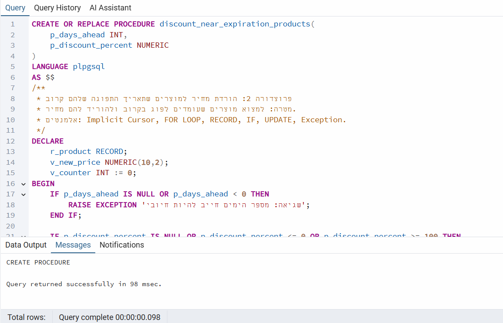

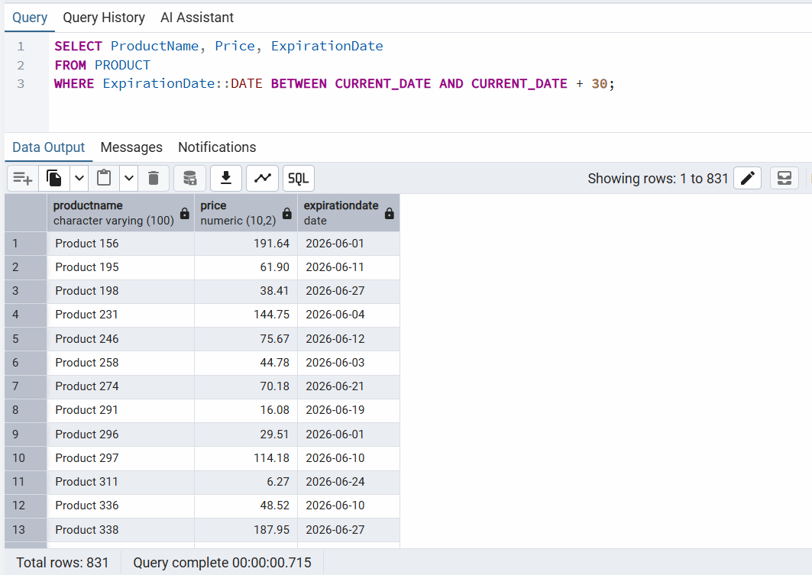

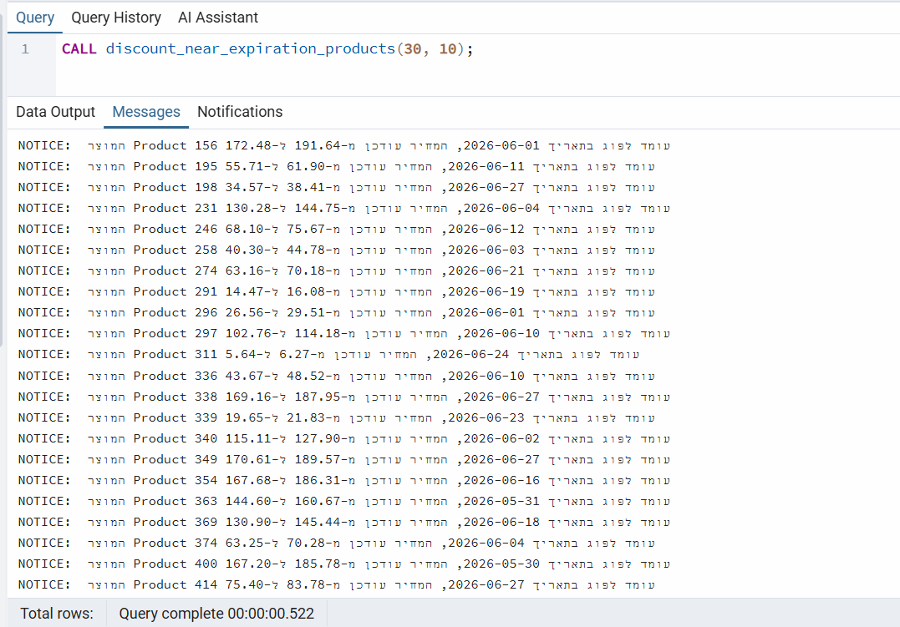

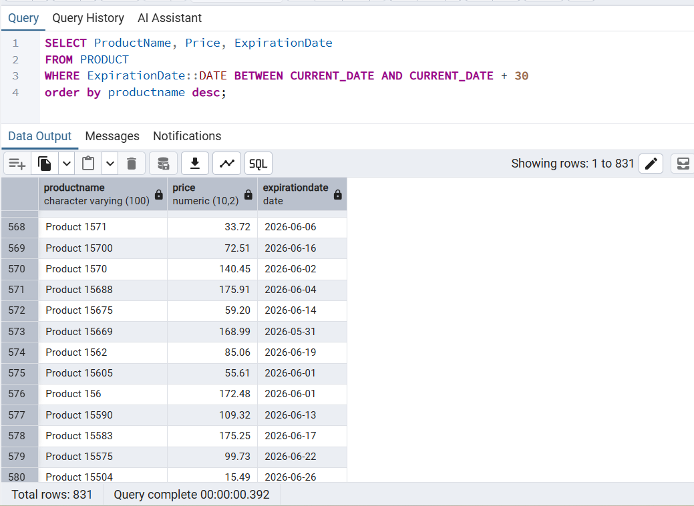

---

# 🔹 פרוצדורה 2 — `[complete_order_and_update_stock]`

## 📌 הכנה
לפני הרצת הפרוצדורה הוספנו עמודה נוספת STATUS לטבלה ORDER.

```sql
ALTER TABLE "ORDER" ADD COLUMN Status VARCHAR(20) DEFAULT 'PENDING';
```

**תיאור מילולי:** פרוצדורה תפעולית מרכזית המנהלת את שרשרת האספקה ומסנכרנת בין הגעת משלוחים לבין מלאי הסניפים ברשת. הפרוצדורה מקבלת מזהה הזמנה, מוודאת את קיומה ואת הסטטוס הנוכחי שלה, ומעדכנת את הסטטוס ל-`COMPLETED`. לאחר מכן, היא רצה על כל פריטי ההזמנה ומקלטת אותם במלאי החנות המשויכת (טבלת `INVENTORY`). במידה ומוצר מסוים מגיע לחנות בפעם הראשונה, הפרוצדורה מזהה זאת אוטומטית ומייצרת עבורו רשומת מלאי חדשה בבסיס הנתונים.

**אלמנטים ותכנוני PL/pgSQL הממומשים בפרוצדורה (עמידה בדרישות המטלה):**
* **סמן משתמע - Implicit Cursor (סעיף a):** שימוש בסמן משתמע יעיל המנוהל אוטומטית על ידי השרת לצורך שליפת רשומות פריטי ההזמנה מתוך טבלת הקשר `CONTAINS`.
* **לולאות - Loops (סעיף e):** שימוש בלולאת `FOR LOOP` מובנית לצורך מעבר סדרתי ועיבוד שורה-אחר-שורה של כל המוצרים והכמויות המשויכים להזמנה הספציפית.
* **רשומות - Records (סעיף g):** הגדרת משתנה רשומה דינמי (`r_item` מסוג `RECORD`) המשמש כעוגן זמני לקליטת נתוני השדות (`ProductID`, `Quantity`) בכל סבב של הלולאה.
* **פקודות DML מרובות ועדכון נתונים (סעיף c):** הפרוצדורה כוללת מספר פקודות עדכון ושינוי נתונים שונות: פקודת `UPDATE` על טבלת `"ORDER"` לשינוי הסטטוס, פקודת `UPDATE` על טבלת `INVENTORY` לעדכון כמויות המלאי, ופקודת `INSERT` מותנית להוספת שורות מלאי חדשות.
* **הסתעפויות (סעיף d):** שימוש נרחב במבני תנאי מורכבים (`IF THEN` ו-`IF NOT FOUND`) בשלבים שונים: בדיקת קיום ההזמנה, חסימת הרצה כפולה להגנה מפני עיוות המלאי, ובדיקה מקומית בתוך הלולאה האם נדרש עדכון מלאי קיים או יצירת שורה חדשה.
* **ניהול חריגות - Exception (סעיף f):** שילוב בלוק טיפול בשגיאות ראשי (`EXCEPTION WHEN OTHERS THEN`) שתופס כל תקלה בלתי צפויה במהלך עדכוני ה-DML, מדפיס הודעה מפורטת עם תיאור השגיאה המקורי של השרת (`SQLERRM`) ומבצע גלגול חריגה (`RAISE`) המפעיל `Rollback` אוטומטי לשמירה על עקביות ושלמות בסיס הנתונים.

---

## 💻 קוד הפרוצדורה

```sql
CREATE OR REPLACE PROCEDURE complete_order_and_update_stock(p_order_id INT)
LANGUAGE plpgsql

AS $$
/**
 * פרויקט בסיסי נתונים - שלב ד' - תכנות PL/pgSQL
 * פרוצדורה מספר 3: השלמת הזמנה ועדכון מלאי החנות (INVENTORY)
 * * מטרה: לסמן הזמנה כ-COMPLETED ולהוסיף את כמויות המוצרים שהגיעו
 * אל המלאי הקיים של החנות הספציפית שביצעה את ההזמנה.
 */
DECLARE
    v_current_status VARCHAR(20);
    v_store_id INT;     -- מזהה החנות המשויכת לטבלת ההזמנה
    r_item RECORD;      -- רשומה זמנית עבור לולאת המוצרים
BEGIN
    -- 1. שליפת הסטטוס הנוכחי ומזהה החנות מתוך טבלת האם של ההזמנה
    SELECT Status, StoreID 
    INTO v_current_status, v_store_id 
    FROM "ORDER" 
    WHERE OrderId = p_order_id;

    -- בדיקה א': הגנה למקרה שההזמנה לא קיימת
    IF NOT FOUND THEN
        RAISE EXCEPTION 'שגיאה: הזמנה מספר % לא קיימת במערכת.', p_order_id;
    END IF;

        -- בדיקה ב': מניעת הרצה כפולה - האם ההזמנה כבר טופלה ונקלטה בעבר?
    IF v_current_status = 'COMPLETED' THEN
        RAISE EXCEPTION 'שגיאה: הזמנה מספר % כבר סומנה כ-COMPLETED. המלאי בחנות כבר עודכן.', p_order_id;
    END IF;

    -- 2. עדכון הסטטוס של ההזמנה ל-'COMPLETED'
    UPDATE "ORDER"
    SET Status = 'COMPLETED'
    WHERE OrderId = p_order_id;

    RAISE NOTICE 'סטטוס ההזמנה % עודכן בהצלחה ל-COMPLETED.', p_order_id;

        -- 3. שימוש ב-Implicit Cursor לריצה על כל המוצרים והכמויות שנמצאים בתוך ההזמנה הזו
    FOR r_item IN 
        SELECT ProductID, Quantity 
        FROM CONTAINS 
        WHERE OrderId = p_order_id
    LOOP
        -- 4. עדכון המלאי בטבלת INVENTORY - הוספת (פלוס) הכמות שהגיעה למלאי החנות
        UPDATE INVENTORY
        SET Quantity = Quantity + r_item.Quantity
        WHERE StoreID = v_store_id AND ProductID = r_item.ProductID;

        -- במידה והמוצר עדיין לא היה קיים בכלל במלאי של החנות הזו (בטיפול חריגות מקומי), נכניס שורה חדשה
        IF NOT FOUND THEN
            INSERT INTO INVENTORY (StoreID, ProductID, Quantity, MinimumStock)
            VALUES (v_store_id, r_item.ProductID, r_item.Quantity, 10); -- 10 כמלאי מינימלי ברירת מחדל
            RAISE NOTICE 'מוצר % לא היה קיים במלאי חנות % - נוצרה רשומה חדשה עם כמות %.', 
                r_item.ProductID, v_store_id, r_item.Quantity;
        ELSE
            RAISE NOTICE 'המלאי עבור מוצר % בחנות % עודכן והועלה ב-% יחידות.', 
                r_item.ProductID, v_store_id, r_item.Quantity;
        END IF;
    END LOOP;

    
    RAISE NOTICE 'תהליך קליטת המשלוח ועדכון המלאי עבור הזמנה % הסתיים בהצלחה.', p_order_id;

EXCEPTION
    -- בלוק טיפול בשגיאות כלליות
    WHEN OTHERS THEN
        RAISE NOTICE 'אירעה שגיאה בתהליך השלמת ההזמנה %: %', p_order_id, SQLERRM;
        RAISE;
END;
$$;
```

---

## ▶️ הפעלת הפרוצדורה

```sql
CALL complete_order_and_update_stock(1);
```

---

## ✅ הוכחת תקינות

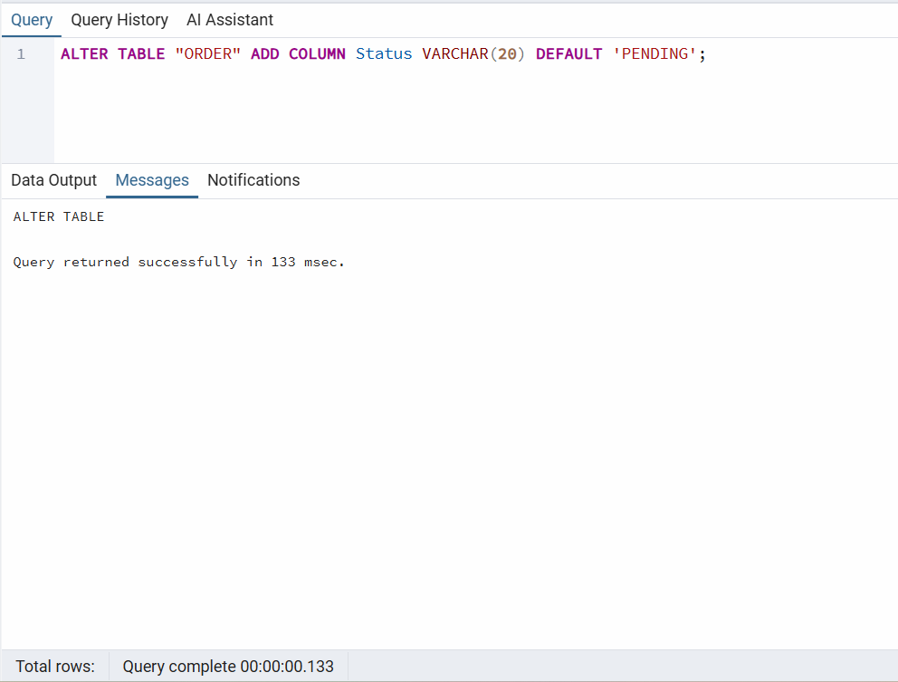

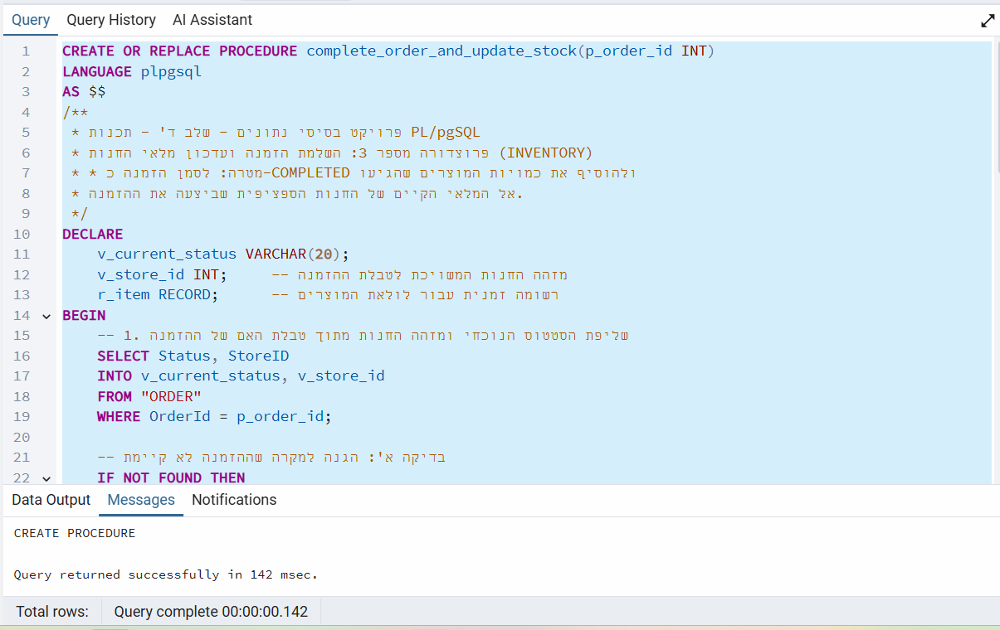

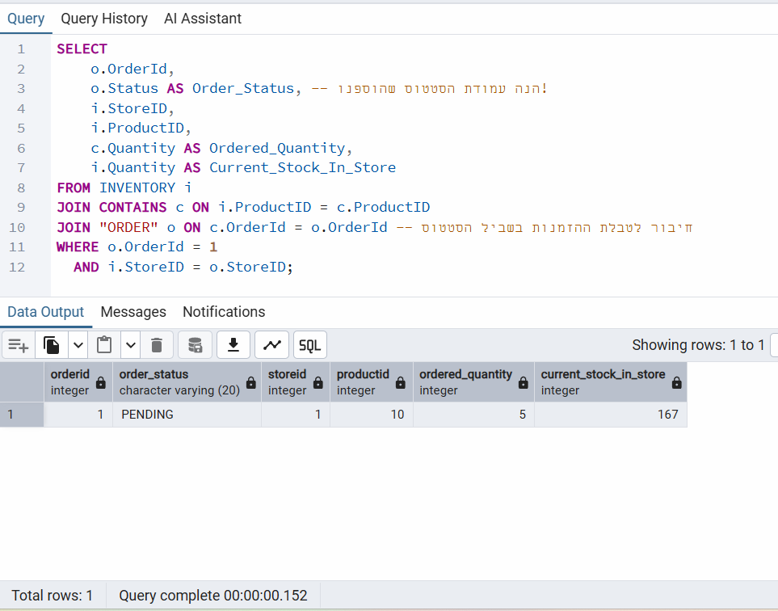

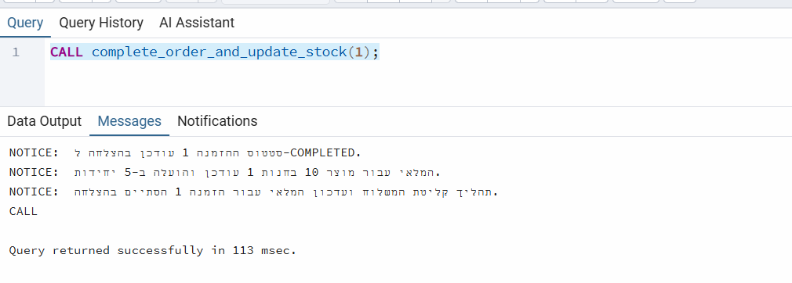

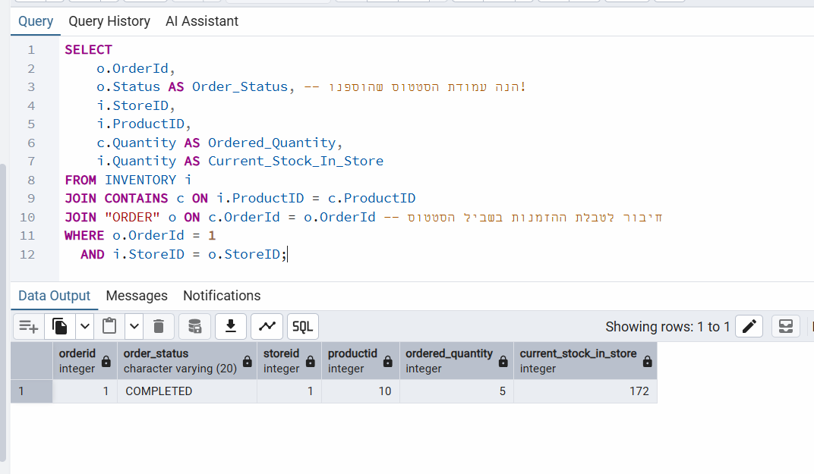

---

# חלק 3: טריגרים (Triggers)

בשלב זה יצרנו מנגנוני Trigger המגיבים אוטומטית לשינויים בבסיס הנתונים.

---

# 🔹 טריגר 1 — `[trg_check_store_rating]`

**תיאור מילולי:** טריגר ולידציה אקטיבי המשמש כמנגנון הגנה ושמירה על שלמות הנתונים (Data Integrity) ברמת השורה בטבלת `STORE`. הטריגר מופעל באופן אוטומטי רגע לפני ביצוע שינויים פיזיים בבסיס הנתונים ומטרתו לאכוף חוק עסקי קשיח: דירוג החנות חייב להיות מספר שלם בטווח של 1 עד 10 בלבד. במידה והמשתמש מזין קלט שגוי, הטריגר קוטע את הטרנזקציה, מונע את כתיבת השורה ומחזיר הודעת שגיאה מפורטת.

**אלמנטים ותכנוני PL/pgSQL הממומשים בטריגר (עמידה בדרישות המטלה):**
* **טריגר בזמן UPDATE והכנסה (סעיף 2.ג):** הטריגר עונה ישירות על דרישת החובה האקדמית ומוגדר לרוץ הן בזמן הזנת שורות חדשות (`INSERT`) והן בזמן עדכון רשומות קיימות (`UPDATE`).
* **טריגר מסוג BEFORE:** הגדרת אירוע הריצה כ-`BEFORE` מאפשרת לקוד התכנותי לתפוס את הרשומה החדשה (`NEW`) בזכרון השרת ולבחון אותה עוד לפני שהיא נכתבת בפועל לדיסק, מה שחוסך משאבי מערכת במקרה של שגיאה.
* **הסתעפויות (סעיף d):** שימוש במבנה תנאי לוגי (`IF THEN`) המשלב אופרטורים להשוואה כדי לבדוק האם הנתון המועבר בעמודת `NEW.Rating` חורג מהגבולות המותרים.
* **ניהול חריגות וזריקת שגיאות (סעיף f):** שימוש בפקודת `RAISE EXCEPTION` מבוקרת השוברת את הטרנזקציה הנוכחית ומבצעת `Rollback` אוטומטי ומיידי, תוך שירשור דינמי של הערך השגוי שהוזן לצורך תיעוד ואינדיקציה ברורה למשתמש.

---

## 💻 קוד פונקציית הטריגר

```sql
CREATE OR REPLACE FUNCTION check_store_rating_fn()
RETURNS TRIGGER AS $$
/**
 * פונקציית טריגר עבור טבלת STORE
 * תפקיד: לבצע ולידציה על שדה הדירוג לפני שמירה בבסיס הנתונים
 */
BEGIN
    -- [1] דרישה: תנאי לוגי (IF) הבודק אם הדירוג החדש מחוץ לטווח המותר (1 עד 10)
    IF NEW.Rating < 1 OR NEW.Rating > 10 THEN
        -- זריקת שגיאה מבוקרת שחוסמת את פקודת ה-SQL ומחזירה הודעה ברורה למשתמש
        RAISE EXCEPTION 'שגיאה: דירוג החנות חייב להיות מספר שלם בין 1 ל-10 בלבד! (ניסיתם להזין: %)', NEW.Rating;
    END IF;
    
    -- אם הנתון תקין, מאשרים את הרשומה (NEW) ומאפשרים לה להיכתב לטבלה
    RETURN NEW;
END;
$$ LANGUAGE plpgsql;
```

---

## 💻 קוד יצירת הטריגר

```sql
CREATE OR REPLACE TRIGGER trg_check_store_rating
BEFORE INSERT OR UPDATE ON STORE
FOR EACH ROW -- הטריגר יבדוק כל שורה בנפרד (Row-Level Trigger)
EXECUTE FUNCTION check_store_rating_fn();
```

---

## ▶️ בדיקת הטריגר

```sql
INSERT INTO STORE (StoreID, StoreName, Phone, StoreEmail, Rating, Address)
VALUES (10000, 'CHECK', '0500000000', 'test@store.com', 12, 'Jerusalem Bait Vagan 12');
```

---

## ✅ הוכחת תקינות

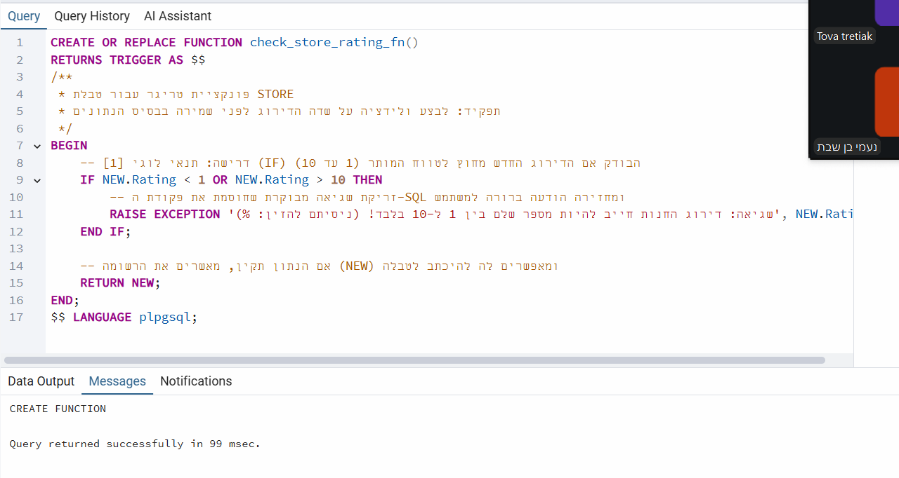

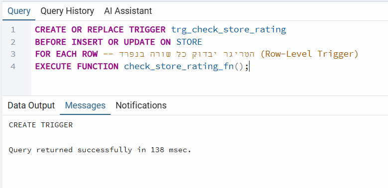

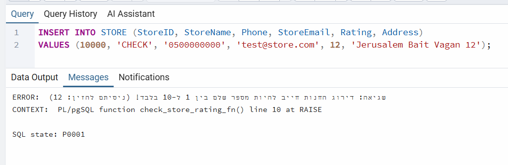

---

# 🔹 טריגר 2 — `[trg_set_order_date]`

**תיאור מילולי:** טריגר אוטומציה מובנה (Automation Trigger) הפועל ברמת השורה על טבלת `"ORDER"`. מטרתו העסקית של הטריגר היא למנוע זיופים, טעויות הקלדה אנושיות או מניפולציות על תאריכי ביצוע ההזמנות ברשת. הטריגר מתעורר ברקע בדיוק ברגע שמבוצעת פקודת יצירת הזמנה, תופס את הרשומה, דורס כל קלט ידני שהוזן (או שלא הוזן) בעמודת התאריך, ושותל במקומו את חותמת הזמן המדויקת של שרת בסיס הנתונים באותו שבריר שנייה.

**אלמנטים ותכנוני PL/pgSQL הממומשים בטריגר (עמידה בדרישות המטלה):**
* **טריגר מסוג BEFORE INSERT (סעיף 2.ג):** הטריגר מוגדר לפעול אך ורק לפני שלב הכתיבה הפיזית של רשומה חדשה לדיסק (`BEFORE INSERT`). הגדרה זו מאפשרת לשנות את ערכי הרשומה בזכרון השרת בצורה דינמית וללא עלות ביצועים של פקודת עדכון נוספת.
* **רשומות ומניפולציה על משתני מערכת (סעיף g):** שימוש ברשומת המערכת הדינמית `NEW` המשקפת את השורה שעומדת להיכנס לטבלה. הקוד מבצע השמה ישירה לעמודה `NEW.OrderDate` באמצעות פונקציית המערכת המובנית `CURRENT_TIMESTAMP`.
* **אבטחה ואמינות נתונים:** הטריגר משמש כמנגנון עוקף תוכנת קצה (Server-Side Enforcement), המבטיח כי תאריך ההזמנה תמיד ישקף נאמנה את זמן השרת האמיתי, ובכך מספק הוכחה קשיחה לאמינות נתוני שרשרת האספקה המוצגים בדו"ח הפרויקט.

---

## 💻 קוד פונקציית הטריגר

```sql
CREATE OR REPLACE FUNCTION set_order_date_fn()
RETURNS TRIGGER AS $$
/**
 * פונקציית טריגר עבור טבלת ORDER
 * תפקיד: אכיפת תאריך יצירה אמין ואוטומטי ברקע
 */
BEGIN
    -- דריסה ידנית של שדה תאריך ההזמנה והשמת הזמן הנוכחי המדויק של שרת ה-DB
    NEW.OrderDate := CURRENT_TIMESTAMP;
    
    -- החזרת הרשומה המעודכנת להמשך ביצוע פעולת ה-INSERT
    RETURN NEW;
END;
$$ LANGUAGE plpgsql;
```

---

## 💻 קוד יצירת הטריגר

```sql
CREATE OR REPLACE TRIGGER trg_set_order_date
BEFORE INSERT ON "ORDER"
FOR EACH ROW -- יופעל עבור כל הזמנה חדשה שנוצרת
EXECUTE FUNCTION set_order_date_fn();
```

---

## ▶️ בדיקת הטריגר

```sql
INSERT INTO "ORDER" (OrderId, Price, StoreID, DriverID, OrderDate)
VALUES (100000, 250.00, 1, 1, '2020-01-01 10:00:00');
```

---

## ✅ הוכחת תקינות

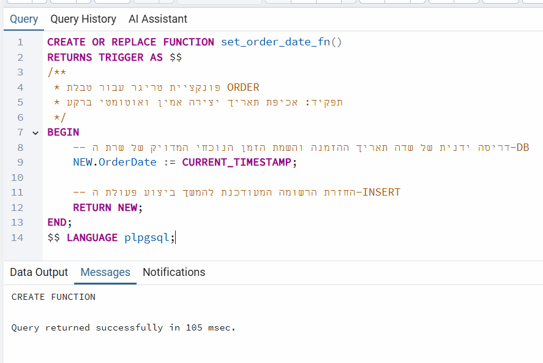

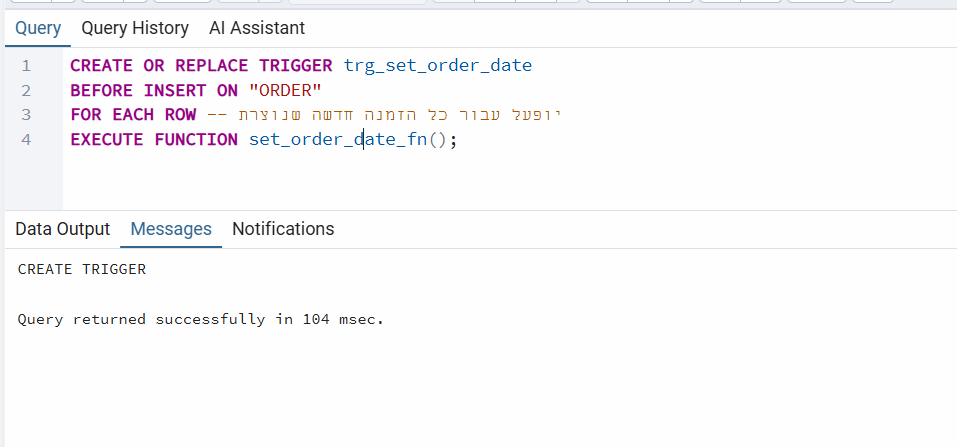

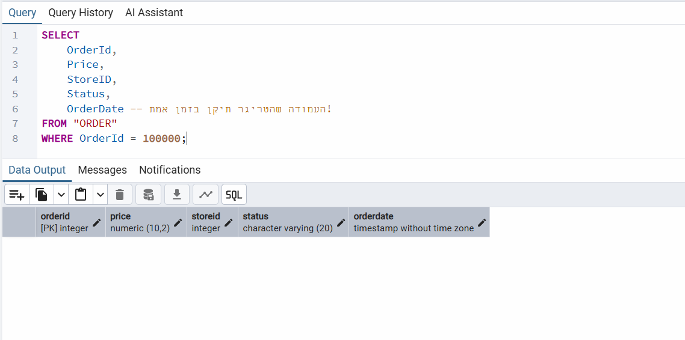

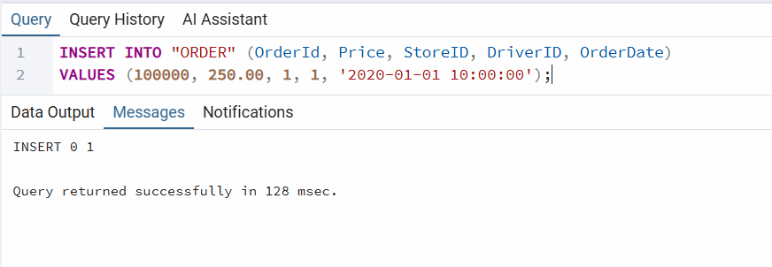

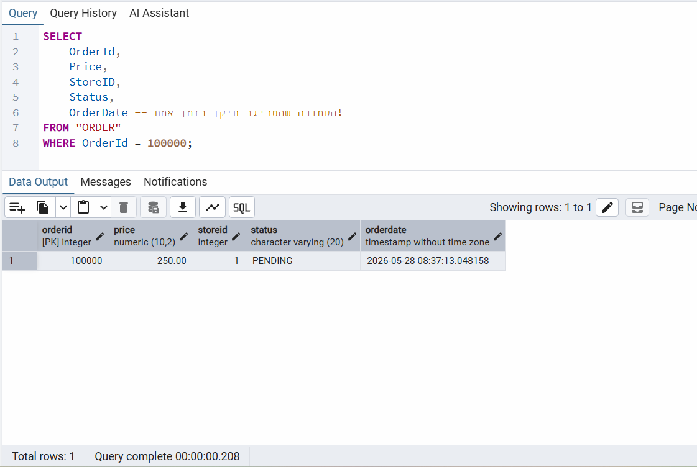

---

# חלק 4: תוכניות ראשיות (Main Programs)

בשלב זה יצרנו שתי תוכניות ראשיות אשר מפעילות פונקציות ופרוצדורות ומדגימות תהליך עסקי מלא.

---

# 🔹 תוכנית ראשית 1 — `[שם התוכנית]`


---

## 💻 קוד התוכנית

```sql
DO $$
/**
 * פרויקט בסיסי נתונים - שלב ד' - תוכנית ראשית מספר 1
 * תיאור: שילוב תהליכים שיווקיים ותפעוליים - החלת הנחות פחת על מוצרים 
 * קרובים לתפוגה והדפסת דוח הנחות אקטיביות להיום.
 * אלמנטים ממומשים: זימון פרוצדורה (CALL), זימון פונקציה המחזירה Ref Cursor,
 * פתיחת טרנזקציה פנימית, לולאת Fetch, רשומת Record, והדפסות לוג.
 */
DECLARE
    -- הגדרת משתנה לקליטת ה-Ref Cursor שחוזר מהפונקציה
    v_discount_rc refcursor;
    
    -- הגדרת רשומה (RECORD) זמנית לצורך מעבר על תוצאות הסמן המוחזר
    r_discount_row RECORD;
BEGIN
    RAISE NOTICE '=== תחילת ריצת תוכנית ראשית 1: עדכון פחת והצגת מבצעים ===';

    -- [א] זימון פרוצדורה מספר 2: החלת 15% הנחה על מוצרים הפגים בעוד 45 ימים
    RAISE NOTICE '--- שלב 1: מפעיל פרוצדורת הנחת מוצרים קרובים לתפוגה ---';
    CALL discount_near_expiration_products(45, 15.00);

    -- [ב] זימון פונקציה מספר 1: שליפת סמן ההנחות הפעילות לתאריך הנוכחי
    RAISE NOTICE '--- שלב 2: מפעיל פונקציה לשליפת הנחות אקטיביות להיום ---';
    v_discount_rc := get_active_discounts(CURRENT_DATE);

    -- מעבר בלולאה על ה-Ref Cursor שחזר מהפונקציה והדפסת הפריטים
    RAISE NOTICE '--- שלב 3: פירוט ההנחות והמוצרים מתוך הסמן המוחזר ---';
    LOOP
        -- שליפת השורה הבאה מתוך ה-Ref Cursor לתוך הרשומה
        FETCH NEXT FROM v_discount_rc INTO r_discount_row;
        -- תנאי יציאה: כאשר נגמרו השורות בסמן
        EXIT WHEN NOT FOUND;

        -- הדפסת הנתונים לחלונית ה-Messages
        RAISE NOTICE 'מבצע: "%" (%%% הנחה) תקף על המוצר: "%" [טווח: % עד %]',
            r_discount_row.DiscountName,
            r_discount_row.DiscountPercentage,
            r_discount_row.ProductName,
            r_discount_row.StartDate,
            r_discount_row.EndDate;
    END LOOP;

    -- סגירת הסמן המוחזר לשחרור משאבי מערכת
    CLOSE v_discount_rc;

    RAISE NOTICE '=== תוכנית ראשית 1 הסתיימה בהצלחה ===';
END $$;
```

---

## ▶️ הפעלה

```sql

```

---

## ✅ הוכחת תקינות


---

# 🔹 תוכנית ראשית 2 — `[שם התוכנית]`


---

## 💻 קוד התוכנית

```sql
DO $$
/**
 * פרויקט בסיסי נתונים - שלב ד' - תכנות תוכנית ראשית מספר 2
 * תיאור: סגירת מעגל הזמנה - קליטת מלאי מוצרים בחנות וחישוב מחיר כולל מעודכן להזמנה.
 * אלמנטים ממומשים: זימון פרוצדורה, זימון פונקציה המעדכנת בסיס נתונים ומחזירה ערך (NUMERIC),
 * שימוש במשתנה מקומי לקליטת ערך חוזר, ומנגנון Exception Handling ראשי.
 */
DECLARE
    -- משתנה לקביעת מספר ההזמנה שנטפל בה (ניתן לשנות לכל מזהה קיים אצלכם)
    v_target_order_id INT := 1;
    
    -- משתנה לקליטת המחיר הסופי שיוחזר מהפונקציה
    v_calculated_final_price NUMERIC(10,2);
BEGIN
    RAISE NOTICE '=== תחילת ריצת תוכנית ראשית 2: קליטת משלוח וחישוב מחיר ===';

    -- [א] זימון פרוצדורה מספר 3: עדכון סטטוס ההזמנה ל-COMPLETED וקליטת מלאי ב-INVENTORY
    RAISE NOTICE '--- שלב 1: מפעיל פרוצדורה לקליטת המשלוח ועדכון המלאי בחנות ---';
    CALL complete_order_and_update_stock(v_target_order_id);

    -- [ב] זימון פונקציה מספר 2: חישוב המחיר הסופי המעודכן ושמירתו במשתנה המקומי
    RAISE NOTICE '--- שלב 2: מפעיל פונקציה לחישוב המחיר המשוקלל הסופי של ההזמנה ---';
    v_calculated_final_price := calculate_order_price(v_target_order_id);

    -- הדפסת סיכום התהליך
    RAISE NOTICE '--- שלב 3: סיכום תוצאות הריצה ---';
    RAISE NOTICE 'התהליך הושלם במלואו! הזמנה מספר % נסגרה. המחיר שסונכרן בטבלה: % ש"ח.',
        v_target_order_id, v_calculated_final_price;

    RAISE NOTICE '=== תוכנית ראשית 2 הסתיימה בהצלחה ===';

EXCEPTION
    -- מנגנון הגנה מרכזי התופס חריגות שהתגלגלו מהפונקציות/פרוצדורות (כמו הזמנה שלא קיימת או כפל הרצות)
    WHEN OTHERS THEN
        RAISE NOTICE '⚠️ אזהרה: ריצת התוכנית הראשית הופסקה עקב חריגה מבוקרת!';
        RAISE NOTICE 'פירוט השגיאה שנתפסה: %', SQLERRM;
END $$;
```

---

## ▶️ הפעלה

```sql

```
---

## ✅ הוכחת תקינות


---


# חלק 5: גיבוי

