# 🛒 דוח פרויקט: ניהול רשת "רמי לוי" - שלב ה'
## ⚙️ יצירת ממשק גרפי לעבודה מול בסיס הנתונים

---

# 📝 הקדמה

בשלב זה של הפרויקט, תרגמנו את תשתית בסיס הנתונים היחסי לכדי אפליקציה שולחנית (Desktop Application) מלאה ואינטראקטיבית, המאפשרת למשתמשי הקצה לנהל את כלל פעילויות הרשת בצורה ויזואלית, מאובטחת וידידותית למשתמש. הממשק נבנה תוך הקפדה על עקרונות הנדסת אנוש, חלוקה ללשוניות פונקציונליות ואחידות עיצובית (מראה Modern Clean).

### 🛠️ הטכנולוגיות והכלים בהם נעשה שימוש:
* **שפת פיתוח:** **Python** – לניהול הלוגיקה והאינטגרציה המהירה.
* **ממשק משתמש (GUI):** **CustomTkinter** בשילוב **Tkinter & TTK** – ליצירת עיצוב מודרני, טבלאות נתונים דינמיות (Treeview) וחלונות מודאליים.
* **בסיס נתונים וקישוריות:** **Psycopg2** – לחיבור ישיר מול שרת ה-PostgreSQL של הרשת, המאפשר הרצת שאילתות, פונקציות ופרוצדורות שרת מורכבות (`CALL` / `SELECT`).
* **שלמות הנתונים ויציבות:** מנגנוני `try-except` מובנים לתפיסת חריגות Database (מפתחות כפולים, מגבלות מפתח זר) והצגתם כהודעות אזהרה ידידותיות בעברית (`messagebox`).

### 📊 דגשים ארכיטקטוניים ופיתוח:
* **מימוש CRUD מלא:** המערכת פותחה כך שעבור כל אחת מ-18 הטבלאות בבסיס הנתונים מומשו בהצלחה 4 פעולות ה-CRUD (יצירה, קריאה, עדכון ומחיקה).
* **חשיפת מפתחות ו-ID:** באישור המרצה, הוחלט להציג באופן גלוי בממשק את קודי ה-ID והמפתחות הזרים/הראשיים, וזאת על מנת לאפשר למשתמשי הקצה פיקוח ובקרה מלאה על שלמות הנתונים (Data Integrity) ברחבי הרשת.
* **מדיניות מחיקה עקבית (Cascading Delete Protection):** כחלק מתכנון ארכיטקטורת המערכת, הוחלט בצורה גורפת ועקבית לאורך כל לשוניות האפליקציה שלא לאפשר למשתמש למחוק אף רשומה בטבלה כלשהי, כל עוד קיימים נתונים פעילים בטבלאות אחרות התלויים בה. המערכת מזהה את חסימות השרת באופן מבוקר ומציגה חלונית אזהרה בעברית המנחה את המשתמש אילו פריטים ותלויות עליו לפנות או לבטל תחילה (לדוגמה: חסימת מחיקת ספק כל עוד משויכים אליו מוצרים, או חסימת מחיקת מחסן כל עוד ממוקם בו מלאי).

---

# 📑 פירוט לשוניות המערכת לפי סדר הניווט (Tabs Breakdown)

### 1. 📊 לוח בקרה רשתי (Dashboard)
* **טבלאות מעורבות:** ריכוז שאילתות ונתונים סטטיסטיים מכלל טבלאות מסד הנתונים (`STORE`, `EMPLOYEE`, `INVENTORY`, `ORDER`).
* **מה ניתן לעשות במסך זה:** צפייה במדדים כלליים, גרפים של התפלגות מכירות, רמות מלאי קריטיות ונתוני מאקרו של הרשת לצורך קבלת החלטות ניהוליות בזמן אמת.

נעשה שימוש בשאילתות מורכבות כמו- ספירת סך הסניפים בכל איזור:

```
SELECT COALESCE(Region, 'לא מוגדר'), COUNT(*) 
                FROM STORE 
                GROUP BY Region 
                ORDER BY COUNT(*) DESC;
```

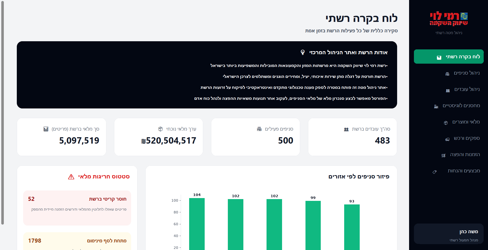
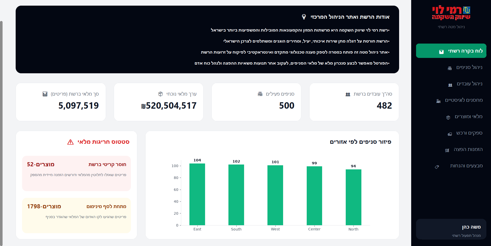

---

### 2. 🏪 ניהול סניפים (Stores)
* **טבלאות מעורבות:** טבלת הסניפים הראשית (`STORE`).
* **מה ניתן לעשות במסך זה:** * צפייה ברשימת כלל חנויות הרשת, כתובותיהן ומיקומן הגיאוגרפי.
    * ביצוע פעולות CRUD מלאות: הקמת סניף חדש ברשת, עריכת פרטי סניף קיים ועדכון כתובות.
    * **בקרת תלויות (Data Integrity):** מנגנון המחיקה חסום אוטומטית ברמת השרת במידה והסניף פעיל ומכיל עובדים או מלאי, ומקפיץ למשתמש הודעת אזהרה מונחית בעברית.

        נעשה שימוש בשאילתא מורכבת:

    הצגת פרטי הסניפים עם סך העובדים בכל סניף:

    ```
    SELECT s.StoreID, s.StoreName, s.Phone, s.StoreEmail, s.Rating, s.websiteurl, s.Address, s.Region,
                           COUNT(e.EmployeeID) AS TotalEmployees
                    FROM STORE s
                    LEFT JOIN EMPLOYEE e ON s.StoreID = e.StoreID
                    WHERE s.StoreName ILIKE %s
                    GROUP BY s.StoreID, s.StoreName, s.Phone, s.StoreEmail, s.Rating, s.websiteurl, s.Address, s.Region
                    ORDER BY s.StoreID ASC;
    ```

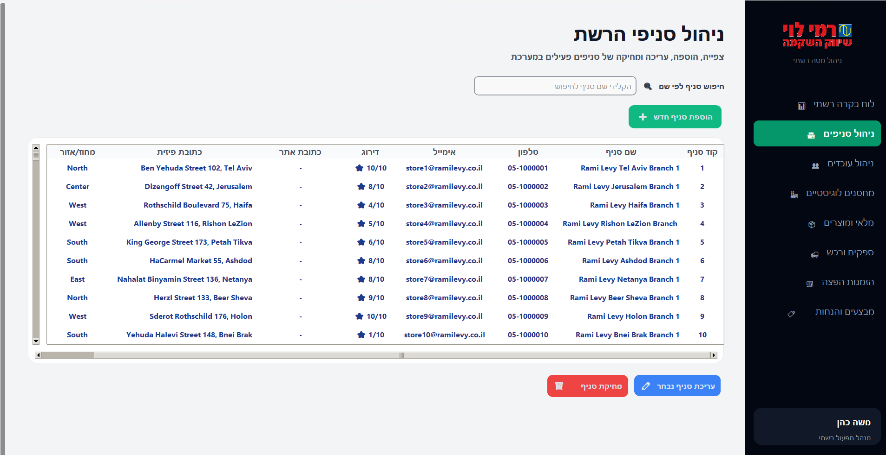
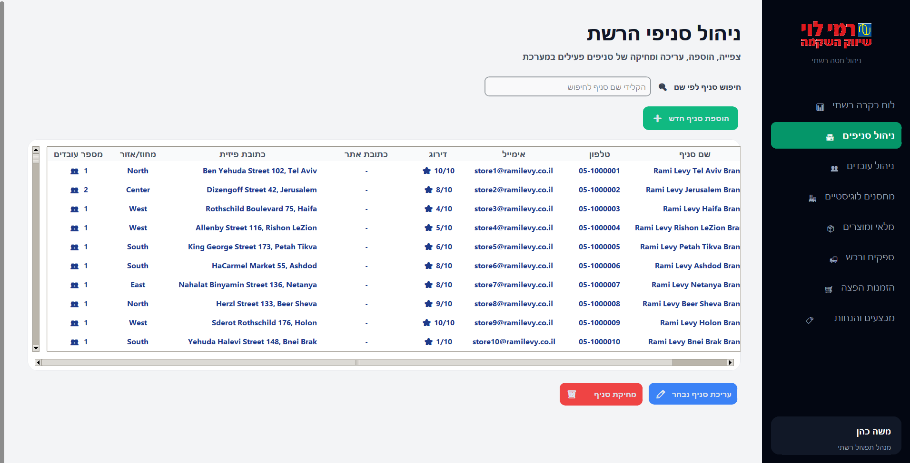

---

### 3. 👥 ניהול עובדים (Employees)
* **טבלאות מעורבות:** טבלת עובדים (`EMPLOYEE`) המקושרת לטבלת הסניפים (`STORE`).
* **מה ניתן לעשות במסך זה:**
    * מעקב מקיף אחר מצבת כוח האדם ברשת (תפקידים, שכר, וסטטוס עבודה).
    * סינון וחיפוש דינמי בזמן אמת באמצעות שדות חיפוש משולבים לפי **מספר זהות עובד** ולפי **קוד סניף מספר**.
    * הוספה ועריכה של עובדים באמצעות חלונית מודאלית, שבה בחירת הסניף (מפתח זר) מתבצעת מתוך תפריט בחירה המציג את קוד הסניף ושמו המשולב (למשל: `1 - ירושלים`) למניעת שגיאות הקלדה.
    * בקרת תצוגה: צביעה אוטומטית של שורות העובדים (עובד פעיל בירוק, עובד לא פעיל באדום).
    


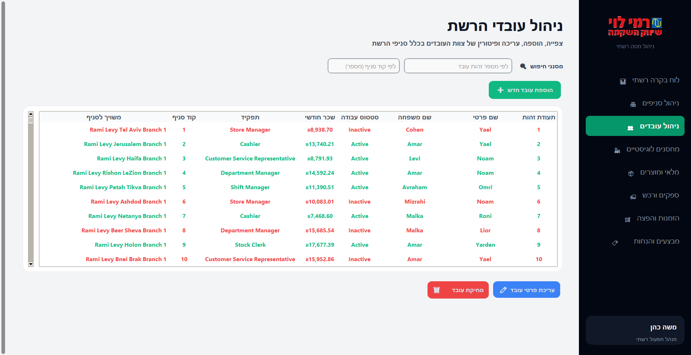

---

### 4. 🏢 מחסנים לוגיסטיים (Warehouses)
* **טבלאות מעורבות:** טבלת מחסנים (`WAREHOUSE`), טבלת מנהלי מחסנים (`WAREHOUSEMANAGER`) וטבלת מיקומי פריטים במלאי המרכזי (`LOCATED`).
* **מה ניתן לעשות במסך זה:**
    * **כרטיסיית מחסנים וצוות ניהול:** הקמת מחסני הפצה חדשים, עריכת כתובותיהם, ומינוי/החלפה של מנהלי מחסנים באזורים השונים.
    * **כרטיסיית איתור ומיקומי מוצרים במלאי:** הצבה פיזית של מוצרים מהקטלוג בתוך מעברים ומדפים מוגדרים במחסנים. מסך זה קריטי שכן ממנו נלקחות ההזמנות להפצה לחנויות.
    * בקרת תצוגה ומחיקה: כל שורות הטבלה מוצגות בגופן כחול כהה מודגש לקריאות מרבית. מחיקת מחסן חסומה ומקפיצה הודעה מפורטת אם המחסן עדיין מכיל סחורה במעברים שלו.

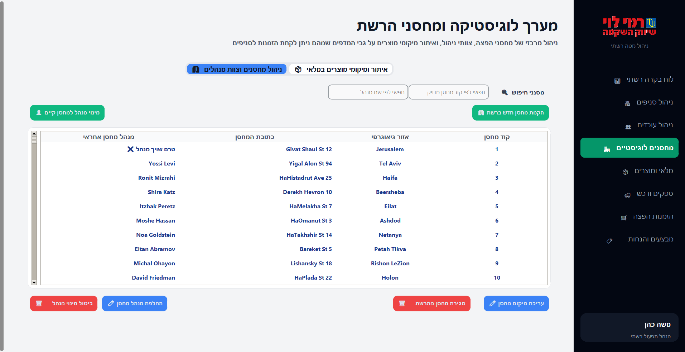
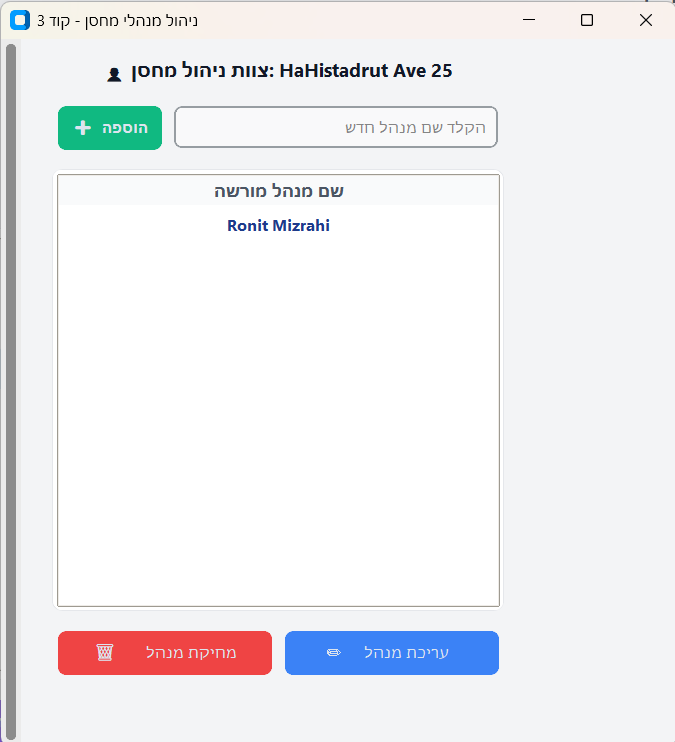
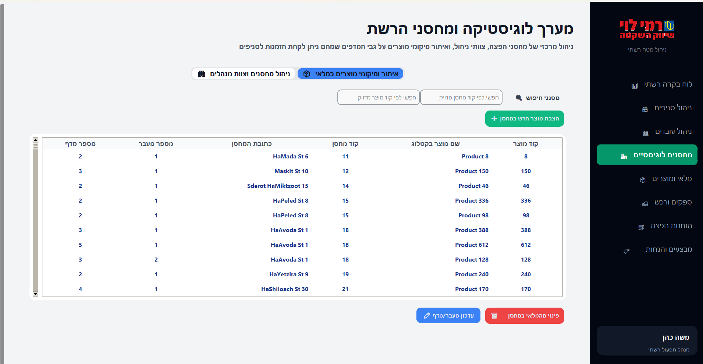

---

### 5. 🍎 מלאי ומוצרים (Inventory & Catalog)
* **טבלאות מעורבות:** טבלת קטלוג המוצרים המרכזית (`PRODUCT`), טבלת סטטוסי כשרות (`PRODUCT_KASHRUT`), טבלת מחלקות (`CATEGORY`) וטבלת רמות מלאי פיזיות בחנויות (`INVENTORY`).
* **מה ניתן לעשות במסך זה:**
    * **קטלוג מוצרים וכשרות:** הוספה ועריכה של פריטים, מחיקת מוצרים, והגדרת סטטוסי כשרות ובד"צים בתיבת טקסט חופשית מותאמת. הטבלה מציגה גופן כחול כהה מודגש עם גלילה מלאה.
    * **קטגוריות:** הקמה וניהול של מחלקות הרשת, תוך צביעת קטגוריות שאינן פעילות ברקע אדום אזהרה.
    * **מלאי בסניפים:** מעקב דינמי אחר כמויות פריטים בכל חנות. המערכת משווה בין הכמות בפועל לרף המינימום וצובעת אוטומטית: מלאי תקין ב**רקע ירוק**, ומלאי בחוסר (מתחת למינימום) ב**רקע אדום**.

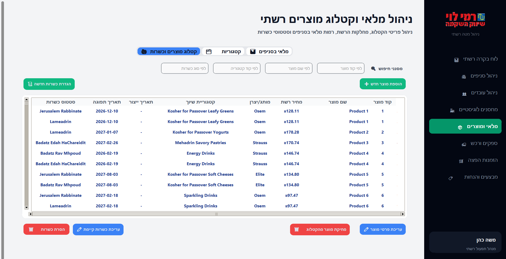
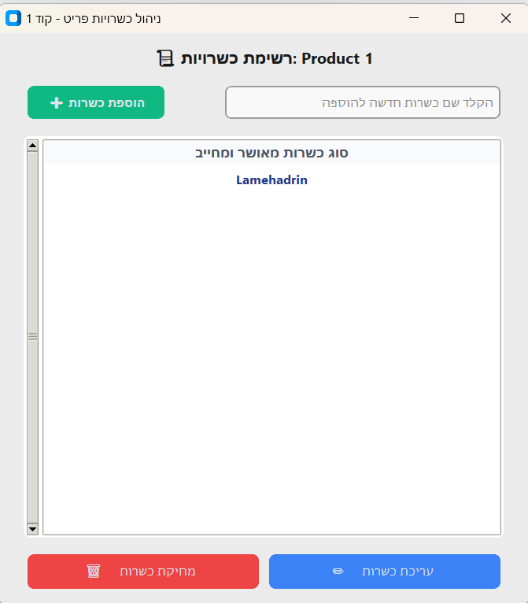
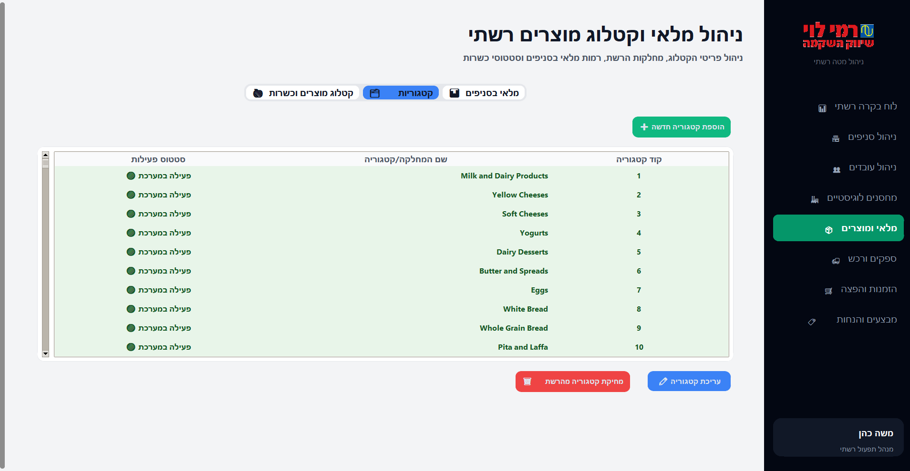
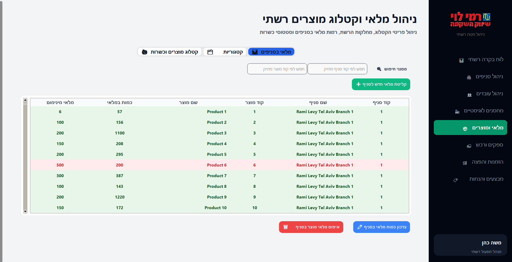

---

### 6. 🚚 ספקים ורכש (Suppliers & Supply Chain)
* **טבלאות מעורבות:** טבלת ספקים (`SUPPLIER`) וטבלת הרשאות אספקה וקטלוג ספקים (`SUPPLIERED_BY`).
* **מה ניתן לעשות במסך זה:**
    * **ניהול ספקי הרשת:** רישום, עריכה ומעקב אחר חברות הספקים המורשות לספק סחורה ישירות אל המחסנים הלוגיסטיים של הרשת.
    * **קטלוג פריטים לפי ספקים:** ניהול טבלת הקשר המשייכת אילו מוצרים מהקטלוג מורשים לרכישה ואספקה מכל ספק.
    * **בקרת מחיקה מוגנת:** לא ניתן למחוק ספק או לבטל שיוך מוצר אם קיימות הזמנות פתוחות או תלויות רכש הממתינות לאספקה ממנו, תוך הקפצת הודעה מונחית בעברית למשתמש.

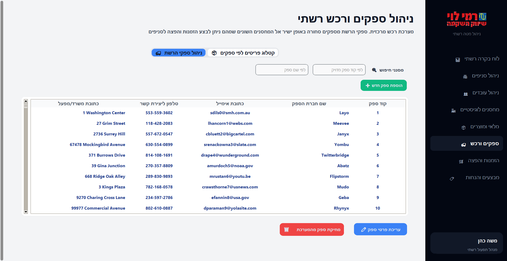
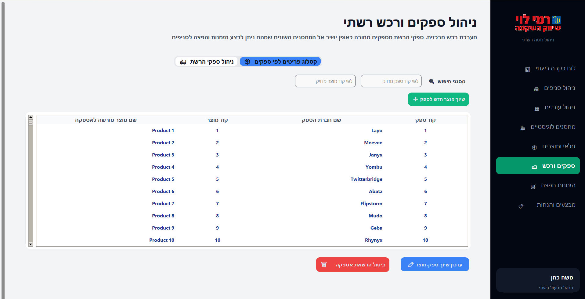

---

### 🛒 7. הזמנות הפצה (Orders & Supply Chain)
* **טבלאות מעורבות:** טבלת הזמנות (`ORDER`), טבלת תכולת פריטים (`CONTAINS`), טבלת רכבי הפצה (`TRUCK`) טבלת חברות משלוחים (`DELIVERYCOMPANY`) , חברת משלוחים איזורית (`DELIVERYCOMPANY_REGIONSERVED`).
* **מה ניתן לעשות במסך זה:**
    * **ניהול הזמנות והפצה:** יצירת הזמנות רכש עבור חנויות, ומעקב אחר סטטוסי אספקה (PENDING, IN TRANSIT וכדומה).
    * **אינטגרציית PL/pgSQL מתקדמת:** במסך זה נעשה שימוש מובנה בפונקציה ובפרוצדורה של מסד הנתונים; הפעלת פונקציית השרת `calculate_order_price` לחישוב עלות סיטונאית אוטומטית, והרצת הפרוצדורה `complete_order_and_update_stock` שסוגרת את ההזמנה ומעדכנת אוטומטית ובאופן ישיר את רמות ה-`INVENTORY` בסניפים.
    * **צי משאיות ונהגים:** פיקוח על משאיות הרשת, כושר הנשיאה שלהן, ורוחב עמודה גלוי המציג את קוד חברת ההפצה האחראית.
    * **חברות הפצה ואזורי שירות:** הגדרת חברות משלוחים חיצוניות ותפעול חברת משלוחים אזורית, עם שטח עמודת מייל מורחב ותצוגת אזורי השירות המורשים ביישור סימטרי משמאל לימין.

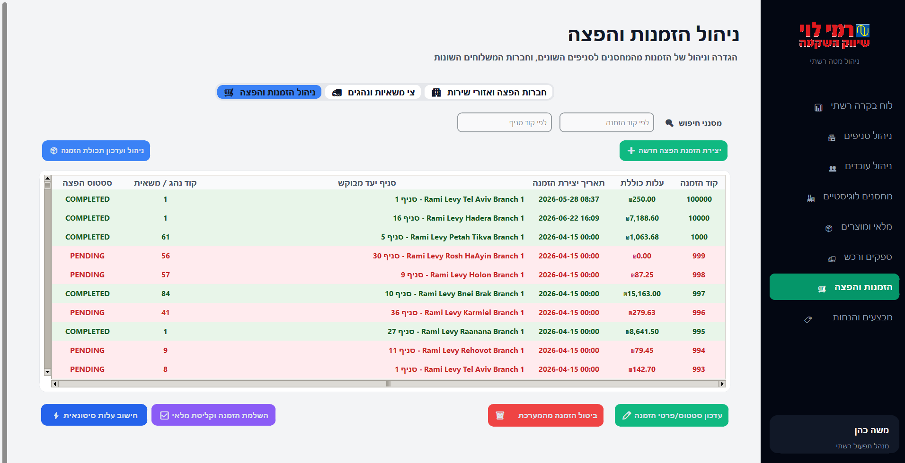
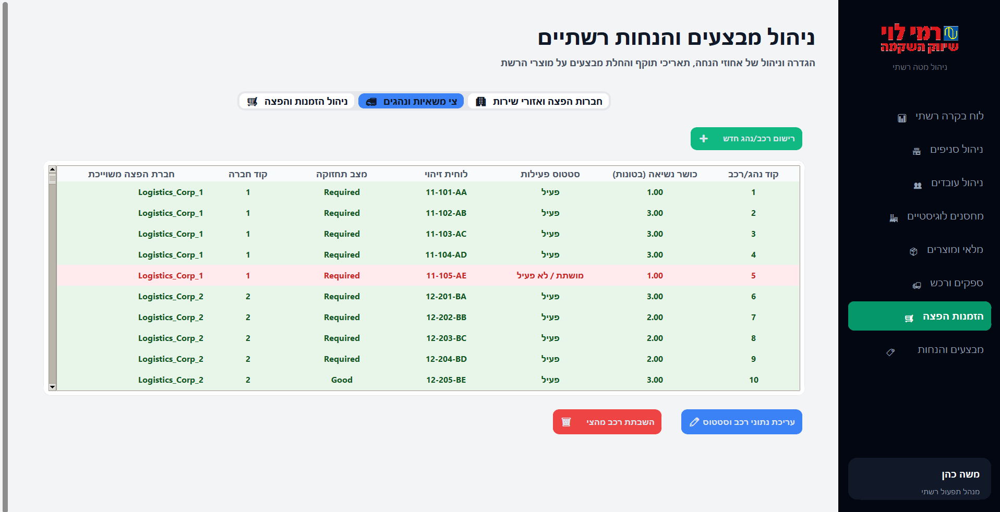
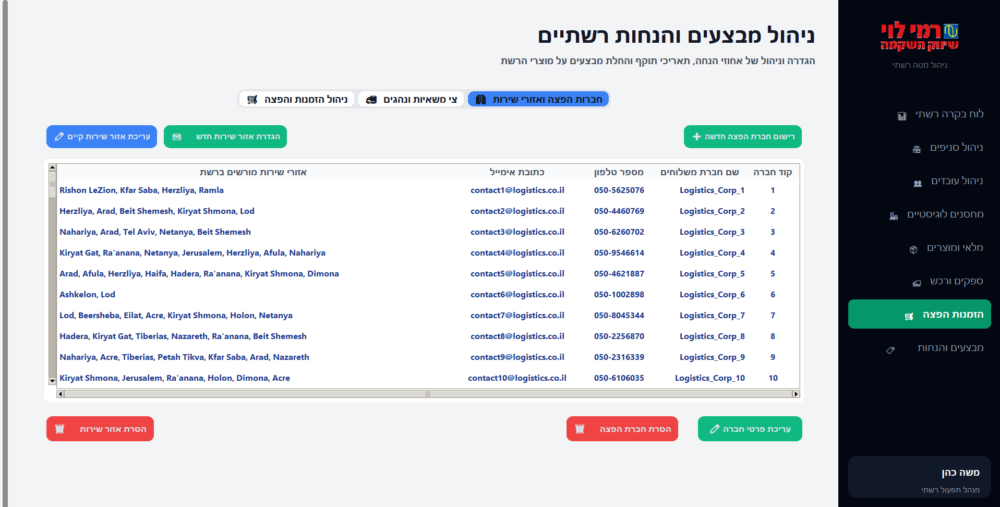

---

### 🏷️ 8. מבצעים והנחות (Discounts & Marketing)
* **טבלאות מעורבות:** טבלת מבצעים קטלוגית (`DISCOUNT`) וטבלת השיוך של מבצעים למוצרים (`APPLIES_TO`).
* **מה ניתן לעשות במסך זה:**
    * **ניהול מבצעים:** הקמה ועריכה של מבצעים קטלוגיים ברשת (אחוזי הנחה, תאריכי תוקף). המסך מבצע בדיקה דינמית מול תאריך השרת וצובע בהתאם: פעיל (ירוק), עתידי (צהוב), ופג תוקף (אדום).
    * **החלת מבצעים על מוצרים:** קישור קוד מבצע לקוד מוצר ספציפי, כולל מסנני חיפוש סימטריים מובנים בזמן אמת לפי **קוד מבצע** ולפי **קוד מוצר**.
    * **סנכרון מלא בצבעים בזמן אמת:** שורות משויכות של מבצעים שבתוקף כרגע נצבעות ב**ירוק**, מבצעים עתידיים נצבעים ברקע **כתום מודגש**, ומבצעים שפגו ברקע **אדום** – כאשר הנתונים והצבעים מסתנכרנים אוטומטית ברגע מעבר הלשונית.

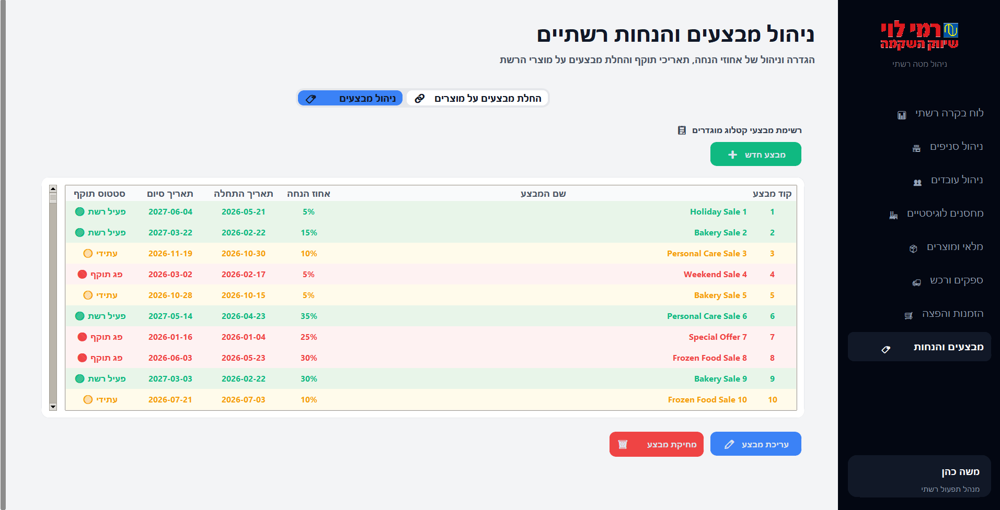
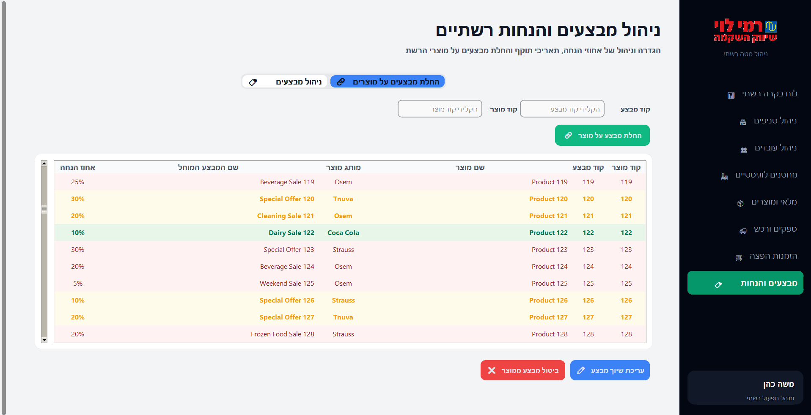

---

## 🚀 הוראות הרצה ותפעול המערכת (VS Code)

כדי להפעיל את ממשק הניהול הגרפי של הרשת, יש לעקוב אחר השלבים הבאים בסביבת העבודה :

### 1. כניסה לסביבת העבודה ופתיחת הטרמינל
* פתח את הפרויקט בתוכנת **VS Code**.
* פתח טרמינל חדש באמצעות קיצור המקשים `Ctrl + ` ` ` (בקרה + גרש) או דרך התפריט העליון: **Terminal** -> **New Terminal**.

### 2. ניווט ותיעול אל תיקיית המקור (Source)
העתק והרץ את פקודת הניווט הבאה בטרמינל כדי  להיכנס אל התיקייה הנכונה ולאחר מכן הרץ את קוד הmain.
```bash
cd "Step 5/src"
python main.py
```
---

### על מנת לתזכר מהו מבנה בסיס הנתונים 

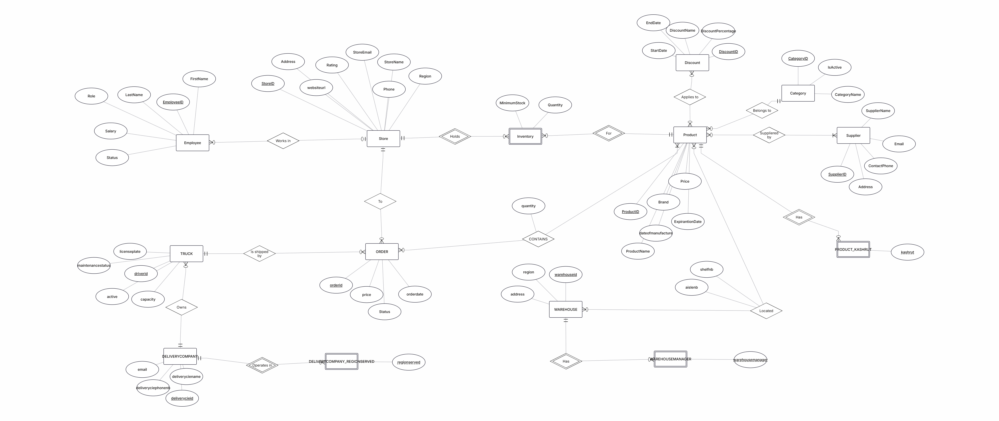

```
CREATE TABLE STORE
(
  StoreID INT NOT NULL,
  StoreName VARCHAR(100) NOT NULL,
  Phone VARCHAR(15) NOT NULL,
  StoreEmail VARCHAR(100) NOT NULL,
  Rating INT NOT NULL,
  websiteurl TEXT,
  Address TEXT,
  Region VARCHAR(50),
  PRIMARY KEY (StoreID)
);

CREATE TABLE EMPLOYEE
(
  EmployeeID INT NOT NULL,
  FirstName VARCHAR(50) NOT NULL,
  LastName VARCHAR(50) NOT NULL,
  Status VARCHAR(20) NOT NULL, -- פעיל/לא פעיל
  Salary NUMERIC(10, 2) NOT NULL,
  Role VARCHAR(50) NOT NULL,
  StoreID INT NOT NULL,
  PRIMARY KEY (EmployeeID),
  FOREIGN KEY (StoreID) REFERENCES STORE(StoreID)
);

CREATE TABLE CATEGORY
(
  CategoryID INT NOT NULL,
  CategoryName VARCHAR(100) NOT NULL,
  IsActive INT NOT NULL, -- 1 לכן, 0 ללא
  PRIMARY KEY (CategoryID)
);

CREATE TABLE PRODUCT
(
  ProductID INT NOT NULL,
  ProductName VARCHAR(100) NOT NULL,
  Price NUMERIC(10, 2) NOT NULL,
  Brand VARCHAR(50) NOT NULL,
  ExpirationDate DATE NOT NULL, -- שימוש בטיפוס DATE כנדרש
  dateofmanufacture DATE,
  CategoryID INT NOT NULL,
  PRIMARY KEY (ProductID),
  FOREIGN KEY (CategoryID) REFERENCES CATEGORY(CategoryID)
);

CREATE TABLE SUPPLIER
(
  SupplierID INT NOT NULL,
  SupplierName VARCHAR(100) NOT NULL,
  Email VARCHAR(100) NOT NULL,
  ContactPhone VARCHAR(15) NOT NULL,
  Address VARCHAR(200) NOT NULL,
  PRIMARY KEY (SupplierID)
);

CREATE TABLE INVENTORY
(
  StoreID INT NOT NULL,
  ProductID INT NOT NULL,
  Quantity INT NOT NULL,
  MinimumStock INT NOT NULL,
  PRIMARY KEY (StoreID, ProductID),
  FOREIGN KEY (StoreID) REFERENCES STORE(StoreID),
  FOREIGN KEY (ProductID) REFERENCES PRODUCT(ProductID)
);

CREATE TABLE DISCOUNT
(
  DiscountID INT NOT NULL,
  DiscountName VARCHAR(100) NOT NULL,
  DiscountPercentage INT NOT NULL,
  StartDate DATE NOT NULL, -- שימוש בטיפוס DATE כנדרש
  EndDate DATE NOT NULL,
  PRIMARY KEY (DiscountID)
);

CREATE TABLE WAREHOUSE
(
  WarehouseID INT NOT NULL,
  Region VARCHAR(50) NOT NULL,
  Address TEXT NOT NULL,
  PRIMARY KEY (WarehouseID)
);


CREATE TABLE DELIVERYCOMPANY
(
  DeliveryCieID INT NOT NULL,
  DeliveryCieName VARCHAR(100) NOT NULL,
  DeliveryCiePhoneNb VARCHAR(20) NOT NULL,
  Email VARCHAR(100) NOT NULL CHECK (Email LIKE '%@%'),
  PRIMARY KEY (DeliveryCieID),
  UNIQUE (DeliveryCieName),
  UNIQUE (DeliveryCiePhoneNb)
);

CREATE TABLE TRUCK
(
  DriverID INT NOT NULL,
  Active SMALLINT NOT NULL DEFAULT 1 CHECK (Active IN (0, 1)), 
  Capacity NUMERIC(10,2) NOT NULL CHECK (Capacity > 0),
  LicensePlate VARCHAR(20) NOT NULL,
  MaintenanceStatus VARCHAR(50) DEFAULT 'Good',
  DeliveryCieID INT NOT NULL,
  PRIMARY KEY (DriverID),
  FOREIGN KEY (DeliveryCieID) REFERENCES DELIVERYCOMPANY(DeliveryCieID),
  UNIQUE (LicensePlate)
);

CREATE TABLE "ORDER"
(
  OrderId INT NOT NULL,
  Price DECIMAL(10,2) NOT NULL CHECK (Price >= 0),
  OrderDate TIMESTAMP NOT NULL DEFAULT CURRENT_TIMESTAMP,
  StoreID INT NOT NULL,
  DriverID INT NOT NULL,
  Status VARCHAR(20) NOT NULL DEFAULT 'PENDING', -- העמודה החדשה שהתווספה לפרויקט!
  PRIMARY KEY (OrderId),
  FOREIGN KEY (StoreID) REFERENCES STORE(StoreID),
  FOREIGN KEY (DriverID) REFERENCES TRUCK(DriverID)
);

CREATE TABLE PRODUCT_KASHRUT
(
  ProductID INT NOT NULL,
  Kashrut VARCHAR(50) NOT NULL,
  PRIMARY KEY (Kashrut, ProductID),
  FOREIGN KEY (ProductID) REFERENCES PRODUCT(ProductID) ON DELETE CASCADE
);

CREATE TABLE WAREHOUSEMANAGER
(
  WarehouseID INT NOT NULL,
  WarehouseManager VARCHAR(100) NOT NULL,
  PRIMARY KEY (WarehouseManager, WarehouseID),
  FOREIGN KEY (WarehouseID) REFERENCES WAREHOUSE(WarehouseID) ON DELETE CASCADE
);

CREATE TABLE DELIVERYCOMPANY_REGIONSERVED
(
  DeliveryCieID INT NOT NULL,
  RegionServed VARCHAR(50) NOT NULL,
  PRIMARY KEY (RegionServed, DeliveryCieID),
  FOREIGN KEY (DeliveryCieID) REFERENCES DELIVERYCOMPANY(DeliveryCieID) ON DELETE CASCADE
);

CREATE TABLE SUPPLIERED_BY
(
  SupplierID INT NOT NULL,
  ProductID INT NOT NULL,
  PRIMARY KEY (SupplierID, ProductID),
  FOREIGN KEY (SupplierID) REFERENCES SUPPLIER(SupplierID),
  FOREIGN KEY (ProductID) REFERENCES PRODUCT(ProductID)
);

CREATE TABLE APPLIES_TO
(
  ProductID INT NOT NULL,
  DiscountID INT NOT NULL,
  PRIMARY KEY (ProductID, DiscountID),
  FOREIGN KEY (ProductID) REFERENCES PRODUCT(ProductID),
  FOREIGN KEY (DiscountID) REFERENCES DISCOUNT(DiscountID)
);

CREATE TABLE CONTAINS
(
  OrderId INT NOT NULL,
  ProductID INT NOT NULL,
  Quantity INT NOT NULL DEFAULT 1 CHECK (Quantity > 0),
  PRIMARY KEY (OrderId, ProductID),
  FOREIGN KEY (OrderId) REFERENCES "ORDER"(OrderId) ON DELETE CASCADE,
  FOREIGN KEY (ProductID) REFERENCES PRODUCT(ProductID)
);

CREATE TABLE LOCATED
(
  ProductID INT NOT NULL,
  WarehouseID INT NOT NULL,
  AisleNb INT NOT NULL CHECK (AisleNb > 0),
  ShelfNb INT NOT NULL CHECK (ShelfNb > 0),
  PRIMARY KEY (ProductID, WarehouseID),
  FOREIGN KEY (ProductID) REFERENCES PRODUCT(ProductID),
  FOREIGN KEY (WarehouseID) REFERENCES WAREHOUSE(WarehouseID)
);

```